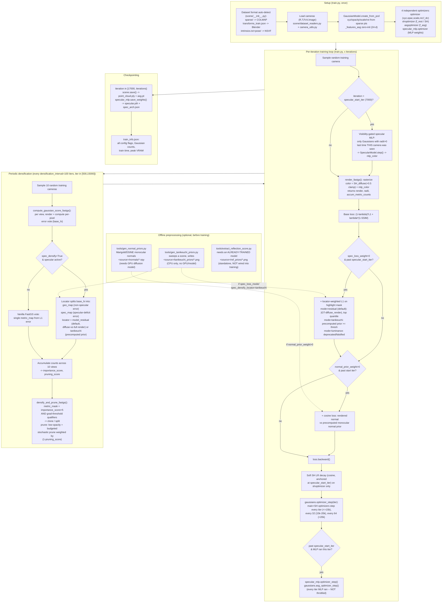

# Spec-FastGS: Technical Pipeline Report

**Scope:** this report documents the codebase exactly as it currently stands at
`D:\Thesis\All\spec-fastgs`, code-verified line-by-line (not from memory or prior
design docs). Where a claim is non-obvious, the file and line range is cited.
`CODE_VERSION` at time of writing: `v3.2-2026-07-04`.

**What this project is:** a 3D Gaussian Splatting (3DGS) reconstruction pipeline that
unifies two independent research lines on top of vanilla 3DGS:

1. **FastGS** — a multi-view-consistency-gated densification scheme that replaces
   vanilla 3DGS's single-view gradient-threshold densification with a vote computed by
   re-rendering from several sampled training cameras, so a Gaussian is only
   cloned/split when multiple views agree it is under-reconstructed.
2. **Spec-Gaussian** — replaces/augments per-Gaussian spherical-harmonic (SH) color
   with a 24-dimensional per-Gaussian Anisotropic Spherical Gaussian (ASG) latent,
   decoded by a small shared MLP into a view-dependent specular RGB **residual**
   added on top of the SH diffuse color — letting sharp, view-dependent highlights be
   modeled without inflating SH degree/storage.

On top of this base, the project has iterated through many opt-in additions (v2.4
through v3.2) targeting two specific failure modes: (A) the specular MLP under-fits
because global L1/D-SSIM loss is dominated by the ~95% diffuse pixels, and (B) the
specular *placement* is wrong because per-Gaussian normals (the ASG reflection axis)
are noisy. All of these additions are **opt-in and default OFF** — the base pipeline
(FastGS densification + Spec-Gaussian ASG branch, no extra losses/locators) is what
runs when no extra flags are passed.

---

## 1. Pipeline Diagram



---

## 2. Data Loading & Scene Setup

### 2.1 Dataset format auto-detection

`scene/__init__.py:64-83` (`Scene.__init__`) picks the loader purely from marker
files/directories present under `source_path` — no config flag selects the format:

```python
if os.path.exists(os.path.join(args.source_path, "sparse")):
    scene_info = sceneLoadTypeCallbacks["Colmap"](args.source_path, args.images, args.eval)
elif os.path.exists(os.path.join(args.source_path, "transforms_train.json")):
    scene_info = sceneLoadTypeCallbacks["Blender"](args.source_path, args.white_background, args.eval)
elif os.path.exists(os.path.join(args.source_path, "intrinsics.txt")) and \
        os.path.isdir(os.path.join(args.source_path, "pose")):
    scene_info = sceneLoadTypeCallbacks["NSVF"](args.source_path, args.white_background, args.eval)
else:
    raise RuntimeError("Unknown dataset format!")
```

| Format | Marker | Reader | Used for |
|---|---|---|---|
| COLMAP | `sparse/` dir | `readColmapSceneInfo` (`scene/dataset_readers.py:179-227`) | Real scenes (Mip-NeRF 360: counter, kitchen, etc.) |
| Blender/NeRF-synthetic | `transforms_train.json` | `readNerfSyntheticInfo` (`:278-287`) | Anisotropic-Synthetic-Dataset |
| NSVF | `intrinsics.txt` + `pose/` | `readNSVFSceneInfo` (`:290-329`) | Synthetic_NSVF |

The synthetic loaders were added on top of an originally COLMAP-only codebase (comment
`dataset_readers.py:230-239`), specifically to reproduce Spec-Gaussian's benchmark
tables.

### 2.2 COLMAP path specifics

`readColmapCameras` (`:88-141`): rotation is stored **transposed**
(`R = np.transpose(qvec2rotmat(extr.qvec))`, `:102-103`), consistent with the
`getWorld2View2` convention used everywhere downstream. Supported camera models:
`SIMPLE_PINHOLE` (single focal, `fx=fy`), `PINHOLE`/`OPENCV`/`SIMPLE_RADIAL`
(`fx=params[0], fy=params[1]`); anything else raises `RuntimeError`. Train/test split
uses the classic LLFF every-8th-holdout: `train = [i%8!=0]`, `test = [i%8==0]`
(`llffhold=8`, `:199-204`), only when `--eval` is passed — otherwise everything is
train.

### 2.3 White-background compositing (synthetic scenes)

`_blend_to_rgb(image, white_background)` (`scene/dataset_readers.py:241-245`):

```python
im = np.array(image.convert("RGBA")).astype(np.float32) / 255.0
bg = np.array([1, 1, 1]) if white_background else np.array([0, 0, 0])
rgb = im[:, :, :3] * im[:, :, 3:4] + bg * (1 - im[:, :, 3:4])
return Image.fromarray((rgb * 255.0).astype(np.uint8), "RGB")
```

Standard alpha-over compositing. Both the Blender and NSVF readers call this, and both
also apply an OpenGL→COLMAP axis-convention flip (`c2w[:3,1:3] *= -1`) before deriving
`R,T` — Blender/NSVF camera files are stored in OpenGL convention (y-up), the rest of
the codebase (COLMAP convention) expects y-down.

Note: the alpha channel is **consumed** here and not carried forward as a mask — unlike
the COLMAP path, where `utils/camera_utils.py:loadCam` (`:13-56`) extracts a real
4-channel `gt_alpha_mask` from the source PNG if one exists (`resized[3:4]`) and passes
it into `Camera(gt_alpha_mask=...)`, which multiplies it into `original_image` at
construction time (`scene/cameras.py:67-73`). Synthetic scenes only ever hand the
camera constructor a pre-composited 3-channel image, so no independent alpha mask
exists for them beyond what's baked into the RGB.

### 2.4 Camera representation

`scene/cameras.py:12-124` (`Camera(nn.Module)`). Key derived fields at construction:
`world_view_transform = getWorld2View2(R,T,trans,scale)^T` (row-vector convention),
`projection_matrix` from FoV, `full_proj_transform = world_view_transform @ projection_matrix`,
`camera_center = world_view_transform.inverse()[3,:3]`. A lightweight `MiniCam` variant
(`:131-158`) takes precomputed transforms directly for GUI/interactive rendering paths.

### 2.5 Scene class responsibilities

`scene/__init__.py`: ties `GaussianModel` + dataset readers + camera loading together.
`self.cameras_extent = scene_info.nerf_normalization["radius"]` (`:119`) — this becomes
the `extent` parameter threaded through densification (Gaussians only clone/split when
their scale is compared against this scene-scale-normalized bound). `save(iteration)`
(`:164-177`) writes `point_cloud.ply` (standard 3DGS PLY schema) **and** a companion
`asg.pt` tensor file for the 24-d ASG features — because the standard PLY attribute
schema has no ASG columns, so ASG features cannot round-trip through a bare PLY load;
resuming from a `.ply`-only checkpoint (`load_ply`, `scene/gaussian_model.py:340-381`)
leaves `_features_asg` unset. Full state (including ASG features and both Gaussian
optimizers' Adam moments) instead round-trips via `GaussianModel.capture()`/`restore()`.

---

## 3. Gaussian Representation

`scene/gaussian_model.py` — `GaussianModel(sh_degree, asg_degree=24, optimizer_type="default")`.

### 3.1 Per-Gaussian parameters

| Parameter | Shape | Role |
|---|---|---|
| `_xyz` | `[N,3]` | position |
| `_features_dc` | `[N,1,3]` | SH DC term (base color) |
| `_features_rest` | `[N,(deg+1)²-1,3]` | higher-order SH (view-dependent diffuse) |
| `_opacity` | `[N,1]` | pre-sigmoid opacity |
| `_scaling` | `[N,3]` | pre-exp scale |
| `_rotation` | `[N,4]` | quaternion |
| `_features_asg` | `[N,24]` | **ASG latent** — Spec-Gaussian's specular parameter, zero-initialized at `create_from_pcd` |
| `xyz_gradient_accum` / `_abs` | `[N,1]` | densification bookkeeping — note the **absolute**-gradient accumulator is a FastGS addition beyond vanilla 3DGS (fed by 2 extra channels in the screen-space-points tensor, see §5) |

`get_normal_axis(dir_pp_normalized, indices=None)` (`:174-183`) derives a per-Gaussian
"normal" as the axis of **smallest scale** (`get_minimum_axis`, sorted ascending, taking
the corresponding rotation-matrix column), flipped to face the viewer. This is the
`normal` fed into the specular MLP's reflection-vector computation (§4) — it is a
purely geometric proxy for surface orientation, not a learned/independent parameter,
which is the root cause of "placement" issues discussed in §7. The optional `indices`
kwarg restricts this (relatively expensive, involves an argsort + rotation-matrix
build) computation to a subset of Gaussians — used by the visibility-gated specular
path in the training loop.

### 3.2 Four independent optimizers

| Optimizer | Owner | Params | Step cadence |
|---|---|---|---|
| `self.optimizer` | GaussianModel | xyz, opacity, scaling, rotation, f_dc | every iter (≤15000); every 32 iters (15000–20000); every 64 iters (>20000) |
| `self.shoptimizer` | GaussianModel | f_rest (SH) | every 16 iters (≤15000); joins main cadence after |
| `self.asgoptimizer` | GaussianModel | f_asg (ASG latent) | every iteration the specular MLP actually ran — **not** throttled |
| `specular_mlp.optimizer` | SpecularModel | MLP weights | same cadence as `asgoptimizer` (both gated on `ran_spec`) |

(Only under `optimizer_type=="sparse_adam"` do all params merge into one
`SparseGaussianAdam`; `optimizer_type="default"` — the normal path — keeps them
separate.) The rationale for exempting the ASG/specular optimizers from the main
32/64-iteration throttle (`scene/gaussian_model.py:236-240`): post-densification, the
main optimizer's throttle would otherwise cap the specular branch's total training
signal at roughly 470 Adam steps over the whole 15k–30k iteration range — far too few
for a from-scratch MLP+latent to learn sharp highlights.

### 3.3 Densification mechanics

Three operations, all FastGS-suffixed variants of the standard 3DGS operations, all
explicitly propagating `_features_asg` alongside the other 6 per-Gaussian tensors so
ASG latents are never silently dropped/misaligned by a clone/split/prune:

- **`densify_and_clone_fastgs(metric_mask, filter)`** (`:517-529`) — duplicates
  selected Gaussians unchanged (including ASG latent) and appends.
- **`densify_and_split_fastgs(metric_mask, filter, N=2)`** (`:492-515`) — replaces
  each selected Gaussian with `N=2` children sampled from its own scale distribution
  (shrunk `old_scale/(0.8*N)`), then prunes the original.
- **`densify_and_prune_fastgs(...)`** (`:531-589`) — the FastGS driver; see §6 for the
  full gating logic (this is where the multi-view `importance_score`/`pruning_score`
  from `compute_gaussian_score_fastgs` actually gets applied).

All three route additions/removals through `cat_tensors_to_optimizer`/`_prune_optimizer`
(`:441-466`, `:398-419`), which iterate over **all three GaussianModel optimizers**
(main, SH, ASG) so their internal Adam moment buffers (`exp_avg`, `exp_avg_sq`) stay
correctly sliced/concatenated in lockstep with the live Gaussian count.

---

## 4. Rendering

`gaussian_renderer/__init__.py` — single function `render_fastgs(viewpoint_camera, pc,
pipe, bg_color, mult, mlp_color=None, scaling_modifier=1.0, override_color=None,
get_flag=False, metric_map=None)`. Uses a **custom, non-stock** CUDA rasterizer
extension (`diff_gaussian_rasterization_fastgs`, distinct from the stock
`diff_gaussian_rasterization` used only for `SparseGaussianAdam`).

Step by step:

1. **Screen-space points buffer**: `[N,4]`, not the standard `[N,2]` — the extra 2
   columns carry the absolute-gradient signal consumed by
   `GaussianModel.add_densification_stats` (`grad[:, :2]` → position gradient,
   `grad[:, 2:]` → absolute gradient, feeding FastGS's split-vs-clone size decision).
2. **Rasterization settings**: standard fields (image size, tanfov, view/proj
   matrices, sh_degree, campos) plus FastGS-specific `mult` (densification-tile
   multiplier), `get_flag`, `metric_map` (hooks that let the CUDA kernel accumulate
   the per-Gaussian importance metric used by densification, returned as the third
   tuple element `accum_metric_counts`).
3. **Diffuse (SH) color**: evaluated in Python (not delegated to the CUDA kernel's
   built-in SH path — `dc=None, shs=None` are passed to the rasterizer explicitly):
   ```python
   sh_color = torch.clamp_min(eval_sh(pc.active_sh_degree, shs_view, viewdir) + 0.5, 0.0)
   ```
   Unless `override_color` is supplied (used to rasterize e.g. world-space normals
   instead of color, for the normal-prior loss — §5), in which case SH evaluation is
   skipped entirely and `sh_color = override_color`.
4. **Specular composition** — the core Spec-Gaussian mechanism:
   ```python
   colors_precomp = sh_color + mlp_color if mlp_color is not None else sh_color
   ```
   A plain **additive residual**, unclamped (unlike the SH-only branch, which is
   clamped `>=0`) — so the specular MLP's raw, unbounded output (no sigmoid, §7) can
   push the final color above 1.0 or, in principle, negative, before whatever
   downstream display/tonemapping clamps it.
5. **Rasterization call** returns `(rendered_image, radii, accum_metric_counts)`.
   `visibility_filter` in the returned dict is `(radii > 0).nonzero()` — an **index**
   tensor, not the boolean mask convention used elsewhere in the codebase; callers
   recompute the boolean form (`radii > 0`) separately when needed.

`render_fastgs` is invoked at up to three distinct points per training iteration
(§5): the main forward render (with `mlp_color`), an optional no-grad SH-only render
(for the `spec_loss_mode="residual"` locator), and an optional normal-map render (for
the normal-prior loss, via `override_color`).

---

## 5. Specular Branch Architecture

### 5.1 Concept

Each Gaussian carries a 24-dimensional learned latent (`_features_asg`). At render
time, for Gaussians currently visible, this latent is linearly projected to 128
raw ASG parameters (amplitude ×2, bandwidth ×2, per lobe, 4×8=32 lobes by default),
which parameterize a bank of **Anisotropic Spherical Gaussian** lobes. These lobes are
evaluated at the per-Gaussian mirror-**reflection direction** (view direction
reflected about the Gaussian's normal-axis), producing a compact "how much light comes
from this reflection direction" encoding, which a further small MLP decodes into a
raw RGB specular residual — this residual is added to the diffuse SH color in the
renderer (§4).

### 5.2 `RenderingEquationEncoding` — the ASG basis evaluator

`utils/spec_utils.py:30-57`. Precomputes `num_theta × num_phi` (default 4×8=32) fixed
lobe axes (`omega`, plus two tangent axes `omega_la`/`omega_mu`) once at construction.
`forward(omega_o, a, la, mu)`:

```python
Smooth = F.relu((omega_o[:, None, None] * self.omega).sum(dim=-1, keepdim=True))
la = F.softplus(la - 1); mu = F.softplus(mu - 1)
exp_input = -la * (self.omega_la * omega_o[:, None, None]).sum(-1,keepdim=True).pow(2) \
            - mu * (self.omega_mu * omega_o[:, None, None]).sum(-1,keepdim=True).pow(2)
return a * Smooth * torch.exp(exp_input)
```

A hemisphere-visibility gate (`Smooth`, ReLU of the dot with the lobe axis) times an
anisotropic Gaussian falloff (softplus-transformed bandwidths `la`/`mu`, shifted by
−1 to match Spec-Gaussian's original parametrization), times amplitude `a`. Output:
`[N, num_theta, num_phi, 2]`.

### 5.3 `ASGRender` — the κ → RGB decoder

`utils/spec_utils.py:64-147`. `__init__(viewpe=2, featureC=128, num_theta=4, num_phi=8,
normal_refine=False, refine_in_dim=24)`: three linear layers, `fc1: in_mlpC→128`,
`fc2: 128→128`, `fc3: 128→3`, where
`in_mlpC = 2·viewpe·3 (positional-encoded viewdir) + 3 (raw viewdir) + num_theta·num_phi·2 (ASG latent, 64-d default) + 1 (normal·viewdir dot) = 80` by default.
`fc3.bias` is zero-initialized.

`forward(pts, viewdirs, features, normal)`:

```python
asg_params = features.view(-1, num_theta, num_phi, 4)
a, la, mu = torch.split(asg_params, [2, 1, 1], dim=-1)
if self.normal_refine:
    delta = 0.3 * torch.tanh(self.refine_mlp(pts))
    normal = self.safe_normalize(normal + delta)
reflect_dir = self.safe_normalize(self.reflect(-viewdirs, normal))   # reflect(v,n) = 2(v.n)n - v
color_feature = self.ree_function(reflect_dir, a, la, mu).view(N, -1)
normal_dot_viewdir = ((-viewdirs) * normal).sum(-1, keepdim=True)
mlp_input = cat([color_feature, normal_dot_viewdir, viewdirs, positional_encoding(viewdirs, viewpe)])
h1 = F.relu(self.fc1(mlp_input))
h2 = F.relu(self.fc2(h1)) + h1     # <-- residual/skip connection
rgb = self.fc3(h2)                 # <-- NO sigmoid/clamp: raw, unbounded residual
return rgb
```

Two architectural decisions from earlier in the project are confirmed present in the
shipped code:
- **No sigmoid on output** (`fc3` returns raw values) — the original baseline applied
  `sigmoid`, which clamps to `[0,1]` and was found to kill bright HDR specular peaks;
  removing it was the first and most impactful architecture fix.
- **Residual/skip connection** around `fc2` (`h2 = relu(fc2(h1)) + h1`) — improves
  gradient flow for the 3-layer MLP, per the Residual-Connections paper
  (arXiv:1710.04773).

Two rejected architecture directions (SIREN activation, Hyper-Connections) were tested
via a synthetic, GPU-free ablation and found to **hurt** (SIREN's sinusoidal prior is
hostile to the additive near-zero specular residual signal) — the codebase correctly
keeps plain ReLU as default, per `utils/spec_arch.py`'s docstring and
`arguments/__init__.py:245-246`.

### 5.4 `SpecularNetwork` / `SpecularNetworkReal` — top-level wrappers

`utils/spec_utils.py:154-217`. Both hold `self.asg_feature = 24` and a
`gaussian_feature: nn.Linear(24, 128)` projecting the latent to raw ASG parameters,
then feed `ASGRender`. `SpecularNetworkReal` exists for real-scene (as opposed to
synthetic) captures; historically it used a smaller network (`featureC=32`, 2×4=8
lobes) which under-represented sharp metal/glass highlights — it was bumped to match
`SpecularNetwork`'s full capacity (`featureC=128`, 4×8=32 lobes).

### 5.5 `SpecularModel` — training/checkpoint wrapper

`scene/specular_model.py`. Owns a dedicated Adam optimizer
(`{'params': specular.parameters(), 'lr': feature_lr/10}`) with a linear-noise LR
schedule from `feature_lr` down to `feature_lr/20` over
`iterations - specular_start_iter` steps. `step(asg_feature, viewdir, normal)` is a
thin pass-through to the wrapped network.

**Checkpoint format detection** (`:190-238`): every saved checkpoint directory
contains both `specular.pth` (state dict) and a `spec_arch.json` sidecar recording the
exact architecture config used (empty `{}` for the default network). On load, a
3-tier fallback resolves the architecture: sidecar JSON → constructor-supplied
`arch_cfg` → shape-based inference from the state dict (`_infer_arch_cfg`, distinguishing
`fc3` (original) from `fc_out` (V2) key names, `featureC`, `latent_mode`, etc.). Separately,
the presence of `render_module.refine_mlp.*` keys in the state dict signals a v2.9
`normal_refine` checkpoint — if found and the currently-constructed network wasn't
built with `normal_refine=True`, the wrapper **transparently rebuilds** the network
with `normal_refine=True` before loading, so old and new checkpoints both load without
manual flags.

### 5.6 `normal_refine` (v2.9) — disk-free self-supervised normal correction

`utils/spec_utils.py:88-103, 117-120`. A tiny bounded correction MLP,
`Linear(24→32) → ReLU → Linear(32→3)`, with the final layer's weight and bias
zero-initialized (guaranteeing a no-op at init):

```python
delta = 0.3 * torch.tanh(self.refine_mlp(pts))    # pts here is actually the 24-d ASG latent
normal = self.safe_normalize(normal + delta)
```

Despite the parameter name `pts`, the caller (`SpecularNetwork.forward`) actually
passes the 24-d ASG latent `x`, not world-space xyz — the correction is a function of
the per-Gaussian latent, not position. Default off (`arguments/__init__.py:235`,
`self.normal_refine = False`); only applies to the original network path, not
`SpecularNetworkV2`.

### 5.7 Alternative architectures — `utils/spec_arch.py`

Opt-in via `--spec_arch '<json>'` or the `SPEC_ARCH` env var (CLI takes priority),
resolved once at `SpecularModel.__init__` (`scene/specular_model.py:70-107`); empty
string/unset keeps the original `SpecularNetwork`/`SpecularNetworkReal`. Implements:

- `SineLayer` (SIREN, ω₀=30) and `GaborLayer` ("real WIRE", ω₀=10, σ₀=10) as
  alternative activations.
- `ASGRenderV2` — configurable `activation∈{relu,siren,wire}`, `depth` (hidden-layer
  count), generalized residual skip (applied at every layer where shapes match, not
  just one hardcoded skip).
- `FiLM` (feature-wise linear modulation, zero-initialized to identity at start) as an
  alternative latent-conditioning mechanism.
- `SpecularNetworkV2(latent_mode='dense'|'lowrank', rank=8, ...)` — `'lowrank'`
  replaces the dense `24→128` projection with `24→rank→128` (LoRA-style), found in
  ablation to be the **best** variant tested (better NCC, far fewer params) — flagged
  as the strongest remaining architecture-side lever, not yet made default.

### 5.8 Activation gating

`specular_start_iter` (default **7000**, `arguments/__init__.py:114`) is the single
threshold gating: first MLP evaluation (`train.py:206`), the specular-targeted loss
term, the ASG/specular optimizer stepping, the SH LR decay anchor point, and whether
densification scoring becomes specular-aware. Starting mid-densification (rather than
at iter 0) is deliberate — densifying before a view-dependent model exists would let
geometry "fake" highlights via Gaussian bloat.

---

## 6. Training Loop — Iteration by Iteration

`train.py`, `CODE_VERSION = "v3.2-2026-07-04..."`.

### 6.1 Setup phase (once)

1. Parse args, print `CODE_VERSION` banner + a full flag summary
   (`specular_start_iter`, `spec_loss_weight/mode`, `normal_prior_weight`,
   `spec_densify(_weight,_locator)`, `spec_arch`, etc.).
2. `gaussians = GaussianModel(sh_degree)`; `scene = Scene(dataset, gaussians)`
   (triggers dataset loading, §2); `gaussians.training_setup(opt)` (builds the 3
   Gaussian-side optimizers, §3.2).
3. Resolve `spec_arch` JSON (CLI or env) → `specular_mlp = SpecularModel(...)`;
   `specular_mlp.train_setting(opt)` (builds its optimizer, §5.5).
4. Background color: white if `dataset.white_background` else black.
5. Three **lazy** dict caches declared (not eagerly populated): per-camera visibility
   mask cache (`vis_cache`), normal-prior cache (`normal_cache`), classical-locator
   prior cache (`tanikeuchi_cache`) — each is populated on first access for a given
   image, and the corresponding prior directories are only ever read from disk, never
   generated in-process (offline tools must run first, §8).

### 6.2 Per-iteration flow

1. **LR/SH-degree update**: `gaussians.update_learning_rate(iteration)`;
   `oneupSHdegree()` every 1000 iters.
2. **Camera sampling**: pop a uniformly random camera without replacement from a
   shuffled stack, refilled when exhausted.
3. **Specular MLP evaluation — visibility-gated** (only if
   `iteration > specular_start_iter`): this is a deliberate speed optimization.
   Typically only 10–30% of Gaussians are on-screen for any given camera, so instead
   of running the MLP over all N Gaussians every iteration, the loop caches which
   Gaussians were visible (`radii>0`) *the last time this exact camera was rendered*,
   and restricts the MLP forward/backward to that subset:
   - If a valid cache exists for this camera (same Gaussian count as now — so it
     auto-invalidates the iteration after any densification event): run the MLP only
     on the cached visible indices, **every iteration** (cheap).
   - If invalid (camera never seen yet, or Gaussian count just changed by
     densification): run the MLP over **all** Gaussians, but throttled to only every
     4th iteration (`spec_full_interval=4`) to bound the cost of these full passes.
   - Output is scattered into a zero-initialized `[N,3]` buffer via a gradient-preserving
     `index_put`, so gradients still flow correctly to only the touched subset.
   - After rendering, the cache is refreshed for this camera using the radii the
     render call just computed — so the mask is always view-correct, just one "camera
     visit" stale.
4. **Render** — `render_fastgs(cam, gaussians, pipe, bg, opt.mult, mlp_color=mlp_color)`.
   In the base configuration (no opt-in losses) this is the **only** render pass per
   iteration — a "quick-win" fix that removed two previously-redundant SH-only +
   gradient passes that used to run every iteration during densification. Each opt-in
   loss below adds one further render call when active:
   - `spec_loss_mode="residual"` (default once `spec_loss_weight>0`): one extra
     no-grad SH-only render, for computing the diffuse-vs-full residual locator.
   - `normal_prior_weight>0`: one extra render (gradients required) with
     `override_color` set to world-space per-Gaussian normals, to rasterize a normal
     map for the cosine loss.
   - `spec_loss_mode="tanikeuchi"`: **no** extra render — the locator is a file read
     instead, by design cheaper than the residual mode.
5. **Base loss**: `loss = (1-lambda_dssim)*L1(image,gt) + lambda_dssim*(1-SSIM(image,gt))`,
   `lambda_dssim=0.2`. Always active, no gating.
6. **(Opt-in a) Specular-weighted highlight loss** — gated on
   `spec_loss_weight>0.0 and iteration>specular_start_iter` (default `spec_loss_weight=0.0`,
   i.e. off):
   - `spec_loss_mode="tanikeuchi"`: loads the precomputed classical-locator score for
     this image, thresholds absolutely at `tanikeuchi_prior_thresh` (default 0.3).
   - `spec_loss_mode="residual"` (default when active): renders a no-grad SH-only
     diffuse image, locator = `|GT-diffuse|.mean(channel)`, thresholded by quantile
     (`spec_loss_quantile`, default 0.97 → top 3%).
   - `spec_loss_mode="luminance"` (deprecated/falsified): locator = raw GT luminance —
     kept only for reproducibility; this mode was found to catch bright-but-diffuse
     surfaces and regress every quality metric.
   - Whichever mask is produced: `loss += spec_loss_weight * mean(|render-gt| * mask) / mean(mask)`.
7. **(Opt-in b) Normal-prior cosine loss** — gated on `normal_prior_weight>0.0 and
   iteration > (normal_prior_start_iter if >=0 else specular_start_iter)` (default
   `normal_prior_weight=0.0`, off): renders world-space per-Gaussian normals via
   `override_color`, transforms to camera frame, compares against a precomputed
   monocular normal prior (`tools/gen_normal_priors.py` output) via
   `1 - cos(n_render, n_prior)`, averaged over pixels where the prior is valid.
8. `loss.backward()`.
9. **Soft SH LR decay**: `gaussians.set_sh_lr_scale(sh_lr_scale_cosine(iteration,
   specular_start_iter, decay_steps=2000, scale_min=0.3, scale_after=0.5))` —
   always computed. Scale is 1.0 before `specular_start_iter`, cosine-decays to 0.3
   over the next 2000 iterations, then holds at 0.5 for the rest of training. This
   scales only the `shoptimizer`'s (f_rest / higher-order SH) learning rate — deliberately
   implemented as an LR scale rather than a gradient multiply, because gradients
   accumulate across up to 64 iterations before `shoptimizer.step()` actually fires
   (see below), and scaling gradients directly would compound multiplicatively across
   that accumulation window.
10. **Densification bookkeeping + periodic densification** — see §7.
11. **Optimizer stepping**:
    - `gaussians.optimizer_step(iteration)`: main optimizer + `shoptimizer` step every
      iteration through iter 15000 (SH every 16th); every 32 iterations from
      15000–20000; every 64 iterations beyond 20000.
    - If `iteration > specular_start_iter` **and** the MLP actually ran this
      iteration: `specular_mlp.optimizer_step()` and `gaussians.asg_optimizer_step()`
      — both run at MLP cadence (every iteration once the visibility cache is warm,
      or every 4th iteration otherwise), explicitly bypassing the main optimizer's
      32/64-iteration throttle so the specular branch isn't starved to ~470 total
      gradient steps over the second half of training.
12. Checkpoint at iterations `17000` and the final `opt.iterations` (default 30000):
    `scene.save()` (PLY + `asg.pt`) and `specular_mlp.save_weights()` (`.pth` +
    `spec_arch.json`).

At the end, `train_info.json` is written with every config flag, initial/final
Gaussian counts, wall-clock training time, and peak VRAM.

---

## 7. Densification: FastGS Vote + Specular-Aware Extension

Runs every `densification_interval` (default 100) iterations, from
`densify_from_iter` (500) through `densify_until_iter` (15000).

### 7.1 Scoring — `compute_gaussian_score_fastgs` (`utils/fast_utils.py:92-225`)

Samples 10 random training cameras (`sampling_cameras`). For each view:

1. Evaluates the specular MLP over the **full** Gaussian set (not visibility-gated,
   unlike the training-loop path) if active, renders `render_image`.
2. Computes a detached photometric-loss map (L1 + 0.2·(1−SSIM)).
3. **If `spec_densify=True` and the specular branch is active** (default off):
   - **Locator selection** (`spec_densify_locator`, default `"model_residual"`):
     - `"tanikeuchi"`: loads the precomputed classical prior for this camera;
       `spec_pixel = prior >= tanikeuchi_prior_thresh`. Falls back to
       `"model_residual"` if no prior file exists for that image.
     - `"model_residual"` (default): renders an additional no-grad SH-only diffuse
       image, computes `e_full=|render-gt|`, `e_diff=|diffuse-gt|`,
       `spec_explained=relu(e_diff-e_full)`, `spec_frac=spec_explained/(e_diff+eps)`,
       `spec_pixel = spec_frac > spec_densify_explained_frac` (default 0.5) — i.e. a
       pixel is "genuinely specular" if the specular branch measurably reduced error
       there relative to the diffuse-only baseline.
   - Splits the base high-error vote into **two** separate accumulators:
     `geo_map = base_hi & ~spec_pixel` (geometric under-reconstruction, NOT
     specular-explained — this is what should still drive normal clone/split) and
     `spec_map = base_hi & spec_pixel` (error the specular branch hasn't fully
     resolved yet — a *specular-deficit* signal). Final importance =
     `geo_counts + spec_densify_weight * spec_counts` (default weight 0.5); the
     **pruning** score uses `geo_counts` only (geometric quality alone decides prune
     candidacy, never specular deficit) — this decouples "should we add more
     Gaussians here to sharpen a highlight" from "is this Gaussian
     multi-view-consistent enough to keep."
4. **If `spec_densify=False`** (default): vanilla FastGS vote — a single
   `compute_metric_map` (L1-normalized-error threshold, optionally excluding the
   brightest GT pixels above `highlight_mask_quantile` — currently defaulted to `1.0`,
   i.e. disabled, since testing found this crude exclusion sacrificed too much
   highlight geometry for too little speed gain).
5. Counts are accumulated (summed) across all 10 sampled views, then normalized to
   `pruning_score` (min-max to `[0,1]`) and `importance_score` (floor-averaged count).

### 7.2 Applying the scores — `densify_and_prune_fastgs` (`scene/gaussian_model.py:531-589`)

1. Standard gradient-based candidacy: position-gradient norm vs `grad_thresh`
   (clone) / absolute-gradient norm vs `grad_abs_thresh` (split); Gaussian scale vs
   `dense*extent` decides which of the two paths a qualifying Gaussian takes.
2. **`metric_mask = importance_score > 5`** — the FastGS contribution: a Gaussian is
   only actually cloned/split if more than half of the 10 sampled views (on average)
   independently flagged it as high-error, regardless of gradient qualification.
3. Pruning: opacity below `min_opacity` (0.005), optionally oversized on-screen/world
   Gaussians; then a **budgeted stochastic** extra prune —
   `remove_budget = 0.5 * candidate_count`, sampled via `torch.multinomial` weighted
   by `1/(1-pruning_score)`, so Gaussians with poor multi-view consistency are
   preferentially (but not deterministically/exhaustively) removed.
4. Opacity is capped at 0.8 after any densify/prune pass.

`final_prune_fastgs` (end of training) additionally removes any Gaussian with
`pruning_score > 0.9`, interpreted as a hard multi-view-inconsistency flag.

---

## 8. Classical Specular Locator: Tan-Ikeuchi + Top-Hat + Near-Saturation

`spec-fastgs/tools/classical_specular_mask.py` — a zero-ML, zero-GPU, offline
per-image specular-candidate scorer, precomputed once per scene
(`tools/gen_tanikeuchi_priors.py`) and consumed by both the loss (§6) and
densification (§7) as an alternative to the on-the-fly model-residual locator.

**Algorithm** (current, v3.2): based on Tan & Ikeuchi's (PAMI 2005) observation that
the per-pixel **minimum** RGB channel `Imin` approximates the specular "pedestal" under
a white-illuminant dichromatic model (a saturated diffuse color has `Imin≈0`; a true
highlight, which lifts all channels toward white, has large `Imin`). Two gates are
applied on top of raw `Imin` thresholding:

1. **Morphological white top-hat** (`Imin - grey_opening(Imin, disk(radius=12))`) —
   suppresses large flat bright/achromatic regions (walls, windows, plates), which
   raw `Imin` thresholding alone floods, while preserving compact bright blobs
   narrower than the structuring disk.
2. **Near-saturation OR-condition** (`Imin > 0.85`) — recovers a false-negative gate 1
   introduces: a genuine highlight *wider* than the structuring disk (e.g. camera
   bloom/glare) gets suppressed by gate 1 exactly like a flat wall, since top-hat's
   rule is purely about spatial size, not physical cause. This condition catches
   pixels near the sensor's actual clipping point, which ordinary room-lit materials
   rarely reach uniformly over a broad area.

Final: `mask = ((tophat > 0.08) | (Imin > 0.85)) & (Imax > 0.6)`.

**Known, measured tradeoff** (full 240-image production-resolution sweep on the
`counter` scene): this locator flags **mean 7.89% / max 17.96%** of pixels, versus the
prior (v3.1) Shafer/Klinker-based locator's **mean 1.44% / max 4.22%** — roughly 5.5×
more of the image is treated as "candidate specular." This was a deliberate,
documented tradeoff decision (Tan-Ikeuchi visually judged more correct on inspection),
not an oversight; the risk (diluting the specular loss/densification signal with
non-specular pixels, similar to a prior regression caused by an overly permissive
luminance-based locator) is flagged directly in code comments and is the first thing
to check if a training run using this locator underperforms.

---

## 9. Standalone Tools (Not Wired Into Training)

### 9.1 Reflection Score — `tools/extract_reflection_score.py`

A **model-free, geometry-gated** multi-view specular locator, built as a more
principled alternative to the model-residual locator for real scenes (where the
model-residual signal can't cleanly separate true specular from diffuse
texture/geometry clutter). Physical basis: a Lambertian point looks the same color
from every view; a specular point's apparent color changes with viewing angle. For
each training camera, it:

1. Renders per-Gaussian depth via the `override_color` trick (encoding view-space z
   as RGB).
2. Finds the `k=8` nearest neighbor cameras by center distance.
3. For each neighbor, reprojects the reference view's points into the neighbor via
   exact point unprojection/projection (`utils/graphics_utils.py`'s
   `cam_intrinsics`/`unproject_depth_to_world`/`project_world_to_camera`), gated by a
   **depth-consistency check** (`|z - neighbor_sampled_depth| < tol`) so occluded/
   geometrically-invalid reprojections don't contaminate the signal — this is the key
   robustification versus a naive fronto-parallel-homography draft that breaks on
   slanted real geometry.
4. Reflection Score = standard deviation of color across all geometrically-valid
   views at each pixel, normalized to `[0,1]`, saved as
   `<source>/ref_priors/<image>_ref_score.png`.

This requires an **already-trained model** (loads Gaussians via `-m`), so it cannot
bootstrap training from scratch — it is explicitly a validate-first, integrate-second
research tool, not currently imported by `train.py` or `utils/fast_utils.py`.

### 9.2 Monocular normal priors — `tools/gen_normal_priors.py`

Generates per-image surface-normal maps via a pretrained monocular estimator
(Marigold, default, via `diffusers`; or DSINE), converts to OpenCV camera-frame
convention (`x right, y down, z into scene`), and saves as `.npy` (`[H,W,3]`,
`[-1,1]`) alongside a visualization PNG. Consumed by the normal-prior cosine loss in
the training loop (§6.2, step 7) when `normal_prior_weight > 0`.

---

## 10. Full Configuration Reference

All defaults from `arguments/__init__.py`; all opt-in features default to their base
(off/vanilla) behavior unless explicitly overridden on the command line.

### Core (always active)
| Flag | Default | Effect |
|---|---|---|
| `iterations` | 30000 | total training iterations |
| `sh_degree` / `asg_degree` | 3 / 24 | max SH band / ASG latent dimensionality |
| `lambda_dssim` | 0.2 | D-SSIM weight in base loss |
| `densification_interval` / `densify_from_iter` / `densify_until_iter` | 100 / 500 / 15000 | densification cadence/window |
| `grad_thresh` / `grad_abs_thresh` | 0.0002 / 0.0012 | clone / split gradient-qualification thresholds |
| `dense` | 0.001 | scale threshold (×extent) separating clone vs split candidates |
| `mult` | 0.5 | rasterizer tile-count multiplier |
| `specular_start_iter` | 7000 | iteration the ASG specular branch activates |
| `sh_decay_steps` / `sh_scale_min` / `sh_scale_after` | 2000 / 0.3 / 0.5 | SH LR cosine-decay schedule anchored at `specular_start_iter` |
| `highlight_mask_quantile` | 1.0 (disabled) | vanilla-FastGS vote's GT-luminance exclusion (found net-negative, kept off) |

### Opt-in additions (all default OFF)
| Flag | Default | Effect when enabled |
|---|---|---|
| `spec_loss_weight` | 0.0 | enables specular-weighted highlight L1 loss |
| `spec_loss_quantile` | 0.97 | top-quantile threshold for residual/luminance locator modes |
| `spec_loss_mode` | `"residual"` | `residual` \| `luminance` (deprecated) \| `tanikeuchi` |
| `normal_prior_weight` | 0.0 | enables DN-Splatter-style normal cosine loss |
| `normal_prior_dir` | `"normals"` | source subfolder for precomputed normal priors |
| `normal_prior_flip` | False | negate prior if alignment diagnostic reports anti-correlation |
| `normal_prior_start_iter` | −1 (falls back to `specular_start_iter`) | when the normal loss starts |
| `spec_densify` | False | enables specular-aware densification vote splitting |
| `spec_densify_weight` | 0.5 | weight of the specular-deficit clone vote vs geometric vote |
| `spec_densify_explained_frac` | 0.5 | fraction-of-error threshold for "this pixel is specular" (model_residual locator) |
| `spec_densify_locator` | `"model_residual"` | `model_residual` \| `tanikeuchi` |
| `tanikeuchi_prior_dir` / `tanikeuchi_prior_thresh` | `"tanikeuchi_priors"` / 0.3 | precomputed classical-locator directory / binarization threshold |
| `normal_refine` | False | enables the disk-free, self-supervised per-Gaussian normal-correction MLP |
| `spec_arch` | `""` (original network) | JSON config selecting `SpecularNetworkV2` variant (activation/depth/latent_mode/rank/film) |
| `run_tag` | `""` | free-text experiment label, logged to `train_info.json` |

---

## 11. Known Limitations / Open Risks (as of v3.2)

1. **Tan-Ikeuchi locator flags ~5.5× more pixels than the prior Shafer locator** —
   validated but not yet GPU-tested in an actual training run; watch for a
   dilution-style regression (Gaussian bloat / PSNR-SSIM drop) the same way an
   earlier overly-permissive luminance locator caused one. Mitigation if it regresses:
   raise `tanikeuchi_prior_thresh` above its 0.3 default.
2. **Root-cause-B (specular *placement*, measured via NCC/σ) remains only partially
   solved.** Three independent interventions (external monocular normal prior,
   disk-free self-supervised `normal_refine`, and specular-aware densification
   allocation) each produced weak, null, or negative results on real (Mip-NeRF)
   scenes — the per-Gaussian normal proxy (smallest-scale axis) appears to be
   identifiability-limited on sparse-specular indoor scenes, not simply
   under-supervised.
3. **Tensorboard writer is instantiated but never written to** — `tb_writer` exists
   but no `add_scalar`/`add_image` calls occur anywhere in the current `train.py`;
   effectively dead code for logging purposes (progress is only visible via the tqdm
   EMA-loss postfix and the final `train_info.json`).
4. **`asgoptimizer`'s Adam moment state is not checkpointed** — `GaussianModel.capture()`
   saves the ASG optimizer's *parameters* (`_features_asg`) but not its optimizer
   state dict, so resuming training always restarts the ASG optimizer's Adam moments
   from scratch even when the rest of the model resumes from a mid-training
   checkpoint.
5. **The Reflection Score locator (§9.1) is unwired** — a more physically-principled
   real-scene locator exists and has been built/validated as a standalone tool, but
   integrating it into the loss/densification locator selection (alongside
   `"residual"`/`"tanikeuchi"`) has not been done.
