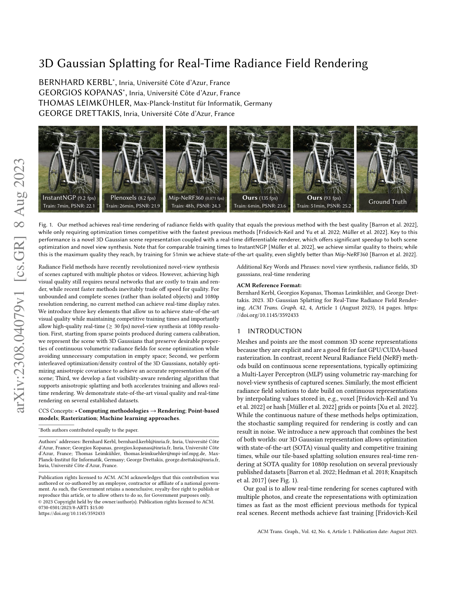
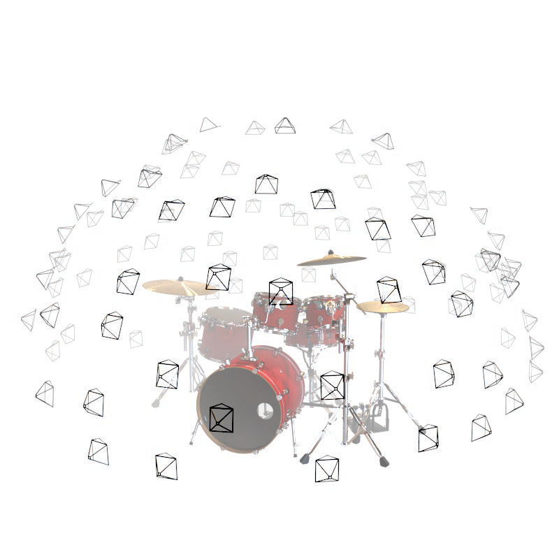
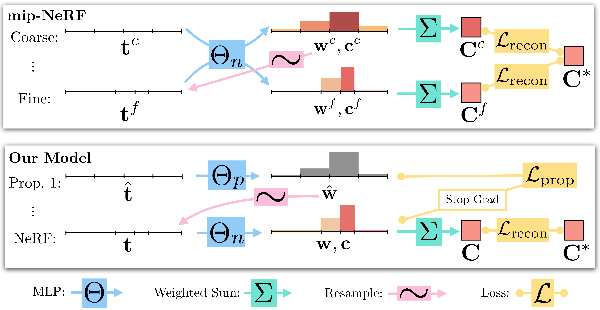
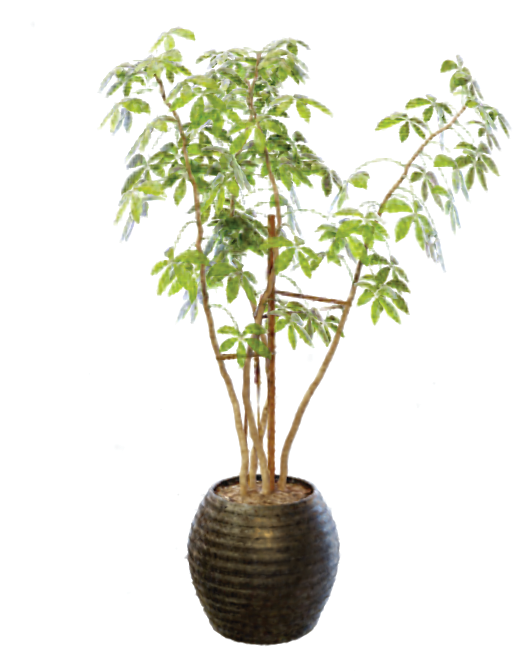
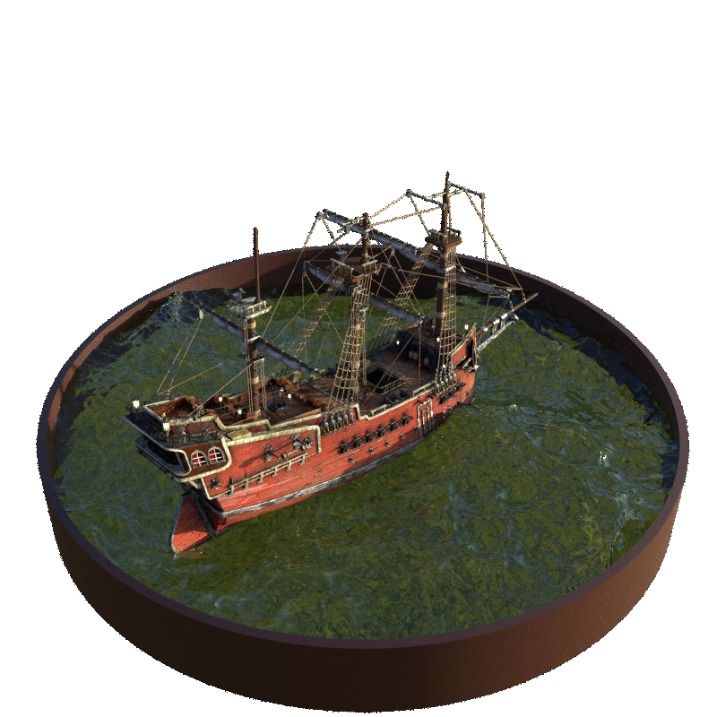
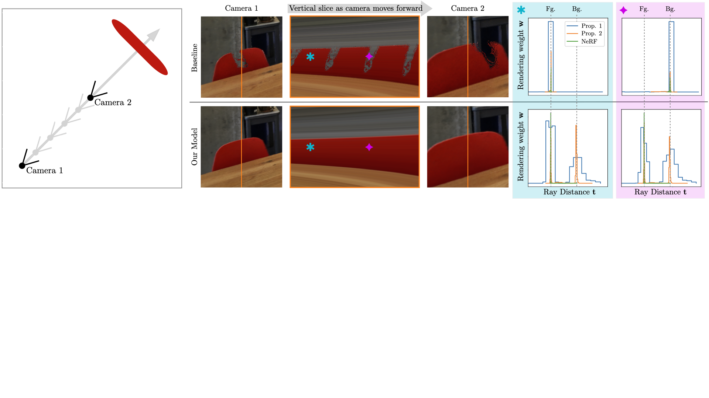
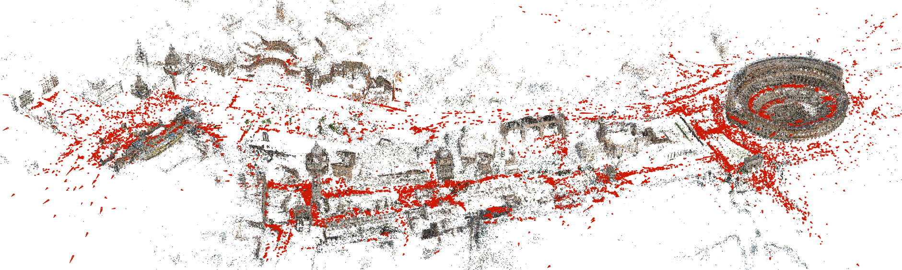
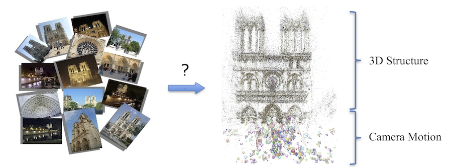

# 00 — Foundational: Radiance Fields & the 3DGS Base

These papers define the representation, the optimization machinery, and the
view-dependent color model (SH) that **both** FastGS and Spec-Gaussian inherit. In the
thesis these belong in the *Background / Preliminaries* chapter.

---

## ★ 3D Gaussian Splatting for Real-Time Radiance Field Rendering — Kerbl et al., SIGGRAPH 2023 — `2308.04079`
**[CORE — the base representation Spec-FastGS extends]**

- **Problem.** NeRF-class methods give photorealistic novel views but are slow to train
  and cannot render at real-time rates at 1080p; fast variants trade away quality.
- **Key idea.** Represent the scene **explicitly** as millions of anisotropic 3D Gaussians
  and render them with a **differentiable, tile-based rasterizer** instead of ray-marching
  an MLP — giving real-time (≥30–100 FPS) rendering with SOTA quality.
- **Method (how).**
  - Each Gaussian stores **position μ**, a covariance Σ factored as `Σ = R S Sᵀ Rᵀ`
    (rotation quaternion + anisotropic scale), **opacity α**, and **view-dependent color
    as spherical-harmonic (SH) coefficients** (degree 3 → 48 coeffs). *This SH color is
    exactly what Spec-Gaussian augments with an ASG specular residual.*
  - **Splatting**: project 3D Gaussians to 2D, sort by depth per tile, α-blend
    front-to-back. Fully differentiable → optimized by image L1 + D-SSIM loss.
  - **Adaptive Density Control (ADC)**: initialize from SfM points; every ~100 iters
    **clone** (under-reconstruction, small Gaussians with high positional gradient) or
    **split** (over-reconstruction, large Gaussians) where the view-space positional
    gradient exceeds a threshold; periodically **prune** low-opacity/oversized Gaussians
    and reset opacity. *This ADC heuristic is the precise target FastGS replaces.*
- **Results.** Real-time rendering with PSNR/SSIM matching or beating Mip-NeRF 360 on the
  Mip-NeRF 360, Tanks & Temples and Deep Blending benchmarks; minutes-scale training.
- **Relevance.** The substrate of the entire thesis. Cite for: the Gaussian primitive,
  SH view-dependence (motivation for the specular branch), the differentiable rasterizer
  (the "3 render passes" you optimized), and the clone/split/prune ADC that FastGS's
  multi-view-consistency densification supersedes.

---

## NeRF: Representing Scenes as Neural Radiance Fields — Mildenhall et al., ECCV 2020 — `2003.08934`
**[REF — origin of neural novel-view synthesis]**

- **Problem.** Photorealistic novel-view synthesis of complex real scenes from a sparse
  set of posed images.
- **Key idea.** Encode the scene as a continuous **5D radiance field** `(x,y,z,θ,φ) →
  (RGB, σ)` in the weights of an MLP, rendered by differentiable **volume rendering**.
- **Method (how).** March rays, sample 3D points, query the MLP, α-composite color/density
  along the ray (`C = Σ Tᵢ(1−e^{−σᵢδᵢ})cᵢ`). Two tricks make it work: **positional
  encoding** (sinusoids) to let the MLP fit high frequencies, and **hierarchical
  coarse/fine sampling**. Trained per-scene with photometric MSE only.
- **Results.** SOTA-2020 view synthesis; but ~1–2 days training and ~30 s/frame rendering.
- **Relevance.** The baseline that 3DGS displaces — cite to frame *why* the field moved to
  explicit Gaussians (speed) and to motivate view-dependent appearance modeling.

---

## Mip-NeRF 360: Unbounded Anti-Aliased Neural Radiance Fields — Barron et al., CVPR 2022 — `2111.12077`
**[REF — source of the primary evaluation benchmark]**

- **Problem.** NeRF/mip-NeRF break on **unbounded 360° scenes**: blurry backgrounds,
  expensive training, and reconstruction ambiguity ("floaters").
- **Key idea.** Three fixes — a **non-linear scene contraction** (map far space into a
  bounded ball), **online distillation** via a small *proposal MLP* that resamples
  intervals for a large *NeRF MLP*, and a **distortion regularizer** that concentrates ray
  weights to kill floaters.
- **Method (how).** Contracted, anti-aliased conical frustums (IPE) feed the proposal/NeRF
  MLP pair; proposal weights are supervised by the NeRF histogram, not the image.
- **Results.** −57% MSE vs mip-NeRF; the de-facto unbounded-scene benchmark.
- **Relevance.** **The Mip-NeRF 360 dataset is your main quantitative benchmark.** Cite for
  the test scenes/metrics; its distortion regularizer and floater discussion connect to
  your quality (SSIM/LPIPS) story.

---

## Instant-NGP: Multiresolution Hash Encoding — Müller et al., SIGGRAPH 2022 — `2201.05989`
**[METHOD — basis for the pending hash-grid appearance field, Sol-7]**

- **Problem.** Coordinate-MLP graphics primitives are slow to train/evaluate; large MLPs
  are needed for high-frequency detail.
- **Key idea.** Replace most MLP capacity with a **multiresolution hash table of trainable
  feature vectors**: a tiny MLP + O(1) hash lookups trains in seconds.
- **Method (how).** A cascade of grid resolutions; each maps corners to a fixed-size
  feature array via a spatial hash. Coarse levels: 1:1; fine levels: collisions average,
  so the largest (most useful) gradients dominate — **no pruning/splitting heuristics**,
  fully GPU-parallel, two hyper-params (table size T, finest res N_max).
- **Results.** Seconds-scale training across gigapixel images, SDF, NRC, and NeRF.
- **Relevance.** Direct blueprint for your **hash-grid appearance field** contribution
  (Sol-7) — an alternative to per-Gaussian SH/ASG that ties appearance to a spatial hash
  grid. Also the conceptual parent of Scaffold-GS (cat 03).

---

## Plenoxels: Radiance Fields without Neural Networks — Fridovich-Keil & Yu et al., CVPR 2022 — `2112.05131`
**[REF — explicit, neural-network-free radiance field]**

- **Problem.** NeRF's day-long training is dominated by MLP evaluations, not by the volume
  renderer.
- **Key idea.** Drop the network entirely: a **sparse voxel grid storing opacity + SH
  coefficients**, trilinearly interpolated and optimized directly with a TV regularizer.
- **Method (how).** Coarse-to-fine grid with empty-voxel pruning; the *same* differentiable
  volume-rendering loss as NeRF, just over explicit parameters.
- **Results.** ~100× faster training than NeRF at equal quality (~11 min bounded).
- **Relevance.** Evidence that **"the key element of NeRF is the differentiable renderer,
  not the network"** — the intellectual justification for explicit 3DGS. Also a clean
  precedent for **SH stored per primitive** (as in 3DGS / your SH branch).

---

## TensoRF: Tensorial Radiance Fields — Chen et al., ECCV 2022 — `2203.09517`
**[METHOD — low-rank factorization precedent for the LoRA-ASG idea, Sol-6]**

- **Problem.** Dense feature-grid radiance fields are fast but memory-heavy and slow to
  reconstruct.
- **Key idea.** Treat the feature grid as a **4D tensor and factorize it into low-rank
  components** (CP decomposition, and a novel **vector-matrix / VM decomposition**).
- **Method (how).** Density and view-dependent color are decoded from sums of vector(/matrix)
  outer products; cuts space complexity from O(n³) to O(n)/O(n²) and acts as a low-rank
  regularizer.
- **Results.** <10 min training, <75 MB, SOTA-2022 quality.
- **Relevance.** The cleanest precedent for your **low-rank ASG factorization (Sol-6)** —
  "replace a dense per-Gaussian latent with shared low-rank factors + per-Gaussian
  coefficients" is exactly TensoRF's move applied to the ASG appearance field.

---

## Zip-NeRF: Anti-Aliased Grid-Based Neural Radiance Fields — Barron et al., ICCV 2023 — `2304.06706`
**[REF — high-quality NeRF baseline]**

- **Problem.** Grid/hash NeRFs (Instant-NGP) are fast but **alias** because point samples
  ignore the pixel footprint; cone-based anti-aliasing (mip-NeRF) hadn't been combined with
  grids.
- **Key idea.** Marry mip-NeRF 360's anti-aliasing with Instant-NGP's hash grids via
  **multisampling + a "z-aliasing" prefiltering** of the hash features.
- **Method (how).** Approximate the conical frustum with multiple downweighted samples and
  feature-space prefiltering, plus an anti-aliased interlevel loss.
- **Results.** SOTA quality on Mip-NeRF 360 with grid-level speed; −8–77% error vs prior.
- **Relevance.** The top-line NeRF quality bar for comparison tables; demonstrates the
  recurring theme (anti-aliasing the footprint) that Mip-Splatting brings into 3DGS (cat
  03), relevant to your quality regression discussion.

---

## COLMAP: Structure-from-Motion Revisited — Schönberger & Frahm, CVPR 2016 — `[2016] COLMAP`
**[REF — the SfM front-end 3DGS depends on]**

- **Problem.** Robust, general **Structure-from-Motion**: recover camera poses + a sparse
  3D point cloud from unordered image collections.
- **Key idea.** An incremental SfM pipeline with improved **scene-graph augmentation, a
  geometric-verification strategy, next-best-view selection, and robust bundle
  adjustment/triangulation** for completeness and accuracy.
- **Method (how).** Feature matching → geometric verification → incremental registration →
  triangulation → repeated bundle adjustment, with outlier filtering throughout.
- **Relevance.** Every 3DGS run (yours included) **initializes Gaussians from COLMAP sparse
  points and uses COLMAP camera poses**. Cite in the data/preprocessing section.

---

## Structure-from-Motion survey — `[2017] Structure-from-Motion survey`
**[REF — SfM background]**

- **Content.** A tutorial/survey of the SfM problem: feature extraction & matching, the
  geometry of two/multi-view reconstruction, incremental vs global SfM, and bundle
  adjustment.
- **Relevance.** Background citation for the *Preliminaries* paragraph that explains where
  the input point cloud and camera calibration come from, before 3DGS optimization begins.
