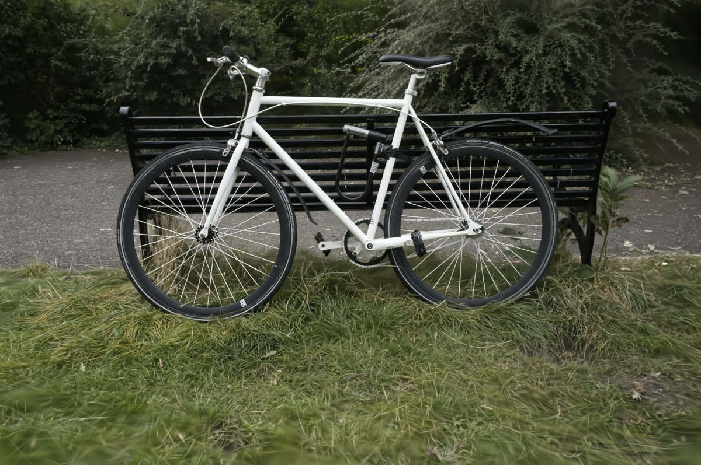
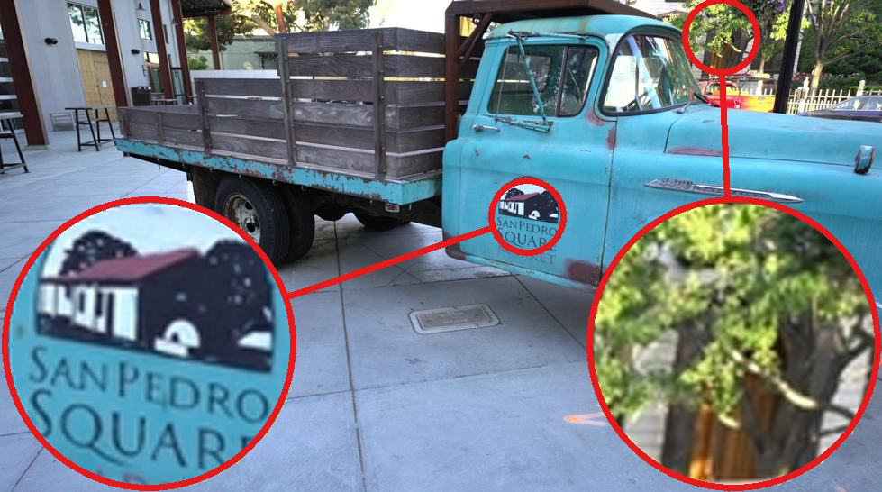
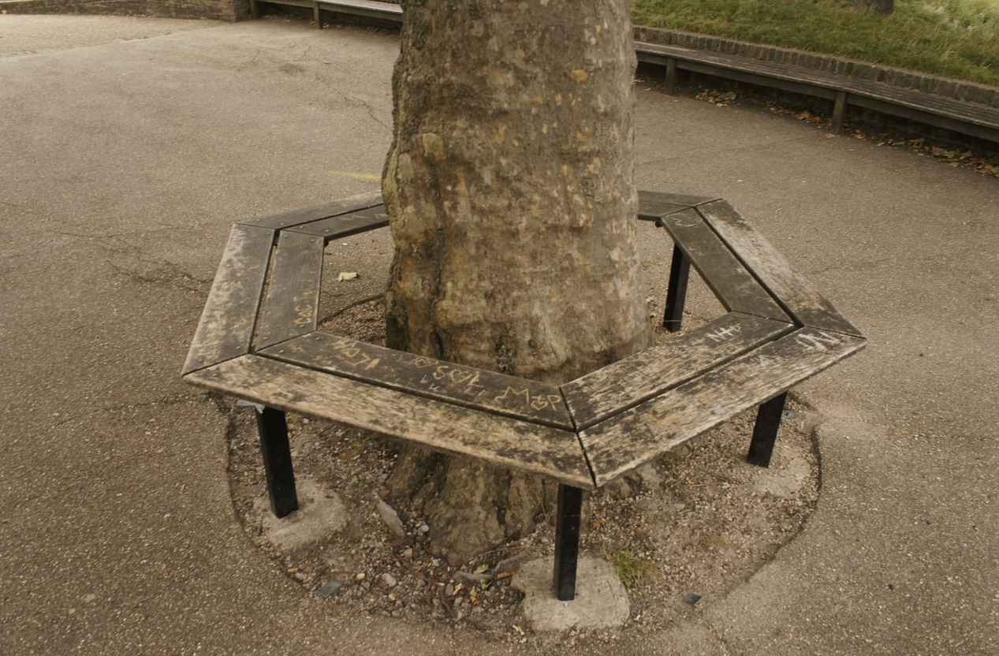
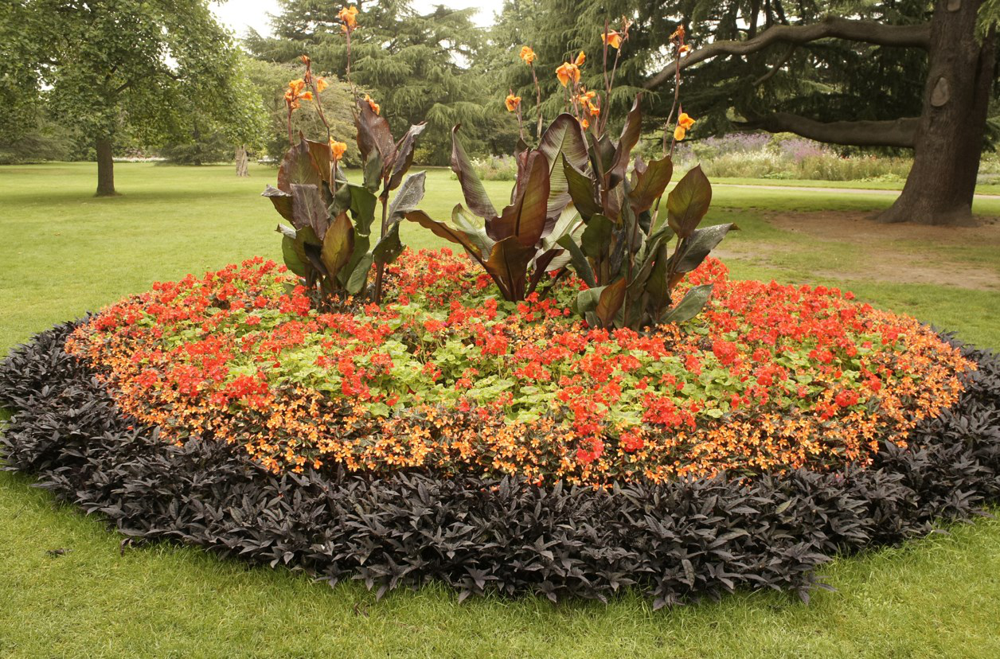
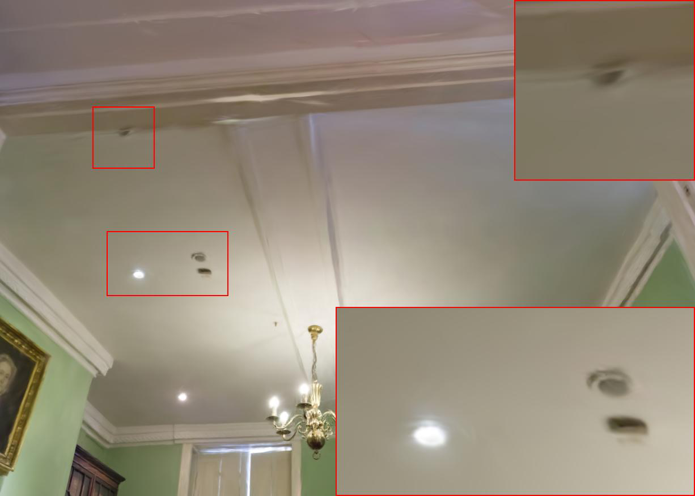
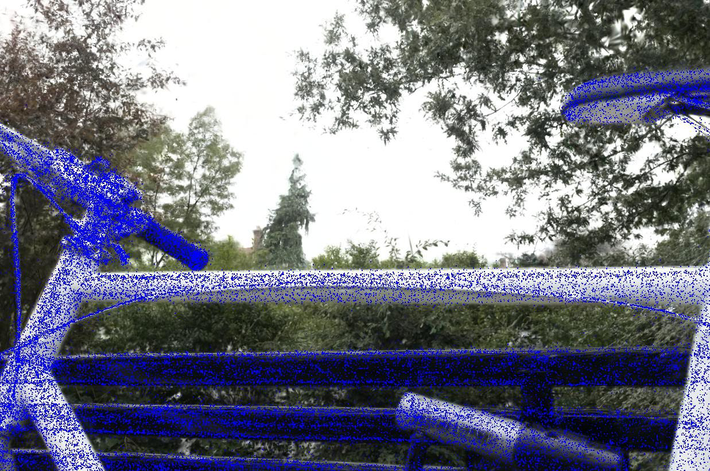
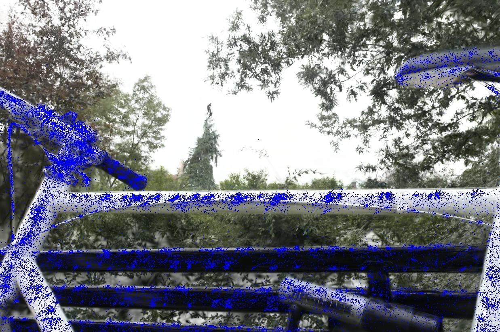
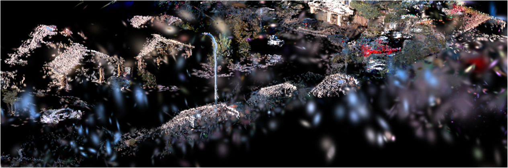
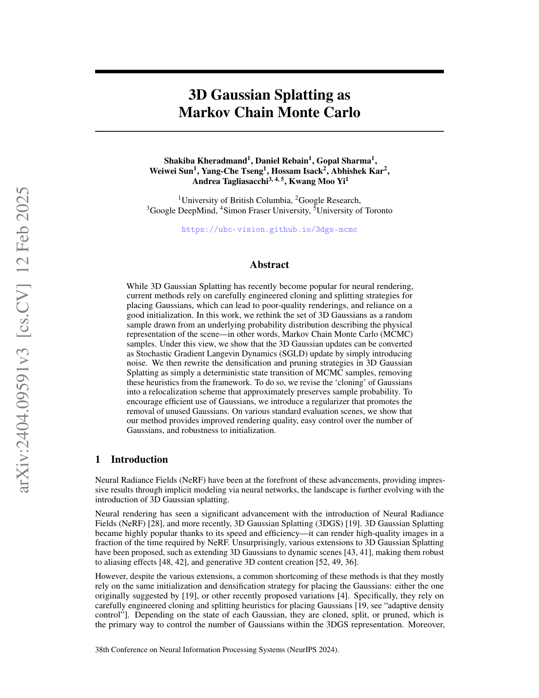
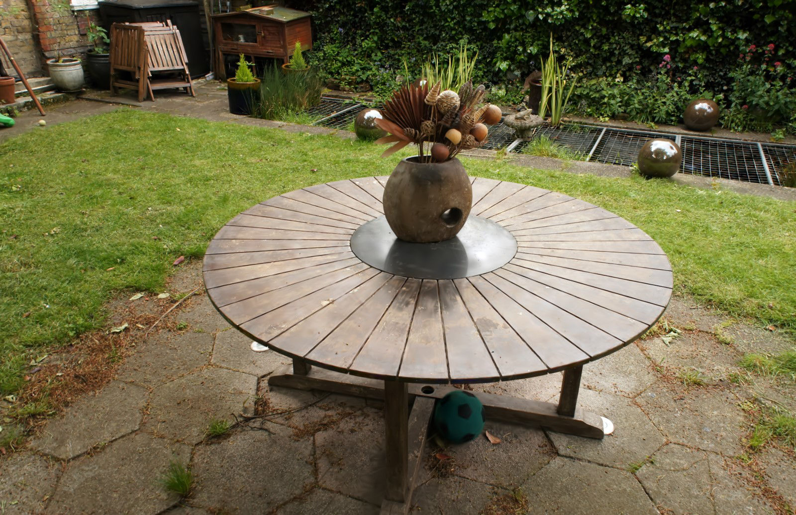

# 01 — Fast Training & Adaptive Density Control

This is the **speed pillar** of the thesis. The story arc: vanilla 3DGS's Adaptive Density
Control (ADC) — clone/split on a positional-gradient threshold + opacity-reset pruning — is
heuristic, produces millions of redundant Gaussians, and inflates training time. Each paper
below attacks one weakness (the densification *criterion*, the *operation*, the *budget/
schedule*, the *pruning*, or the *primitive count*). **FastGS** is the direct baseline; the
rest are the competitive/related landscape your speed chapter must survey.

> **Shared 3DGS recap (cite once):** each Gaussian = {μ, Σ=RSSᵀRᵀ, opacity α, SH color};
> rendered by tile-based α-blending; ADC every ~100 iters clones (small, high-grad) / splits
> (large, high-grad) where the **average view-space positional gradient** exceeds τ, and
> prunes low-α / oversized Gaussians with periodic opacity reset. Almost every paper here
> reframes one term of that sentence.

---

## ★ FastGS: Training 3D Gaussian Splatting in 100 Seconds — Ren, Wen et al., CVPR 2026 (Highlight) — `2511.04283`
**[CORE — the speed half of Spec-FastGS]**

- **Problem.** Existing accelerators "fail to properly regulate the number of Gaussians":
  budget/score methods (Taming, Dash) still keep millions of primitives; gradient/score
  pruning (Speedy-Splat) enforces multi-view consistency only *indirectly* → redundancy or
  quality loss.
- **Key idea.** Score every Gaussian by its **actual contribution to multi-view
  reconstruction quality** and densify/prune strictly on that — **no budget mechanism**.
- **Method (how).**
  - **VCD — multi-view-Consistent Densification:** a *multi-view reconstruction-quality
    importance score* decides whether a Gaussian beneficially raises rendering quality
    across the multiple views that see the same region (analogy to **bundle adjustment**:
    each Gaussian must be consistent across all its observing views). Only genuinely useful
    Gaussians are cloned/split.
  - **VCP — multi-view-Consistent Pruning:** removes Gaussians that are useless to
    multi-view quality, using the same contribution criterion (not just opacity/gradient).
  - Because VCD/VCP *directly* identify which Gaussians matter, no budget/schedule is
    needed → the framework drops into other tasks unchanged. Keeps the Gaussian count
    consistently low for the whole run (Fig. 2 in paper).
- **Results.** ~100 s/scene; **3.29×** faster than DashGaussian on Mip-NeRF 360 at
  comparable quality; **15.45×** vs vanilla 3DGS on Deep Blending; generalizes (2–6×) to
  dynamic, surface, sparse-view, large-scale, and SLAM.
- **Relevance.** Your speed engine. In Spec-FastGS, the **VCD/VCP multi-view-consistency
  score is exactly the densification you keep** while adding the specular branch; your
  *visibility-gated MLP* (`radii>0`) is conceptually aligned with FastGS's "only the
  Gaussians that actually matter per view" philosophy. Cite as the method you extend and
  the speed baseline to beat/match after adding the specular cost.

---

## ★ Taming 3DGS: High-Quality Radiance Fields with Limited Resources — Mallick, Goel, Kerbl et al., SIGGRAPH Asia 2024 — `2406.15643`
**[COMPARE — budgeted, score-based densification]**

- **Problem.** 3DGS's Gaussian count is unpredictable (can vary 10×), inflating memory and
  forbidding fixed-size downstream use.
- **Key idea.** A **purely constructive, budget-constrained** densification: grow the model
  deterministically toward an **exact user-specified Gaussian count** using a **per-Gaussian
  score** (gradient + per-pixel saliency/edges + primitive properties).
- **Method (how).** Sample training views → compute per-pixel saliency → aggregate into a
  per-Gaussian score Sg → densify only near top-scoring Gaussians on a fitted growth curve
  (no heavy pruning). Plus engineering: **per-splat (not per-pixel) backprop parallelization**
  and quality-preserving approximations → 4–5× faster.
- **Results.** 4–5× smaller model & training time at matched quality; surpasses 3DGS with
  larger budgets.
- **Relevance.** The canonical **score-based budgeted** competitor FastGS explicitly argues
  against ("relies on Gaussian-associated scores, not actual rendering contribution"). Cite
  to contrast budget-based vs. FastGS budget-free densification in your related-work table.

---

## DashGaussian: Optimizing 3DGS in 200 Seconds — Chen et al., CVPR 2025 — `2503.18402`
**[COMPARE — resolution + primitive scheduling; FastGS's main speed baseline]**

- **Problem.** Time cost is dominated by **optimization complexity = render resolution ×
  primitive count**; high-res early training and huge late-stage counts are wasteful.
- **Key idea.** Reframe optimization as **progressively fitting higher frequency bands**;
  schedule **rendering resolution** (low→full) and **primitive growth** (concave-up curve)
  together, with a **momentum-based primitive budget** estimated per scene.
- **Method (how).** Frequency-based resolution scheduler downsamples training views early
  (fitting low frequencies first), synchronized with a primitive scheduler that prevents
  over-densification at low res; plug-and-play onto any 3DGS backbone (+45.7% speed avg).
- **Results.** ~200 s/scene; +45.7% training speed without quality loss.
- **Relevance.** **The speed number FastGS beats by 3.29×** — your headline comparison.
  Note: `CLAUDE.md` says DashGaussian was **deliberately dropped** from Spec-FastGS, so cite
  it as a considered-but-rejected scheduling alternative.

---

## Speedy-Splat: Fast 3DGS with Sparse Pixels and Sparse Primitives — Hanson et al., CVPR 2025 — `2412.00578`
**[COMPARE — rasterizer + pruning speedups]**

- **Problem.** Render cost ∝ (#Gaussians) × (#pixels/Gaussian); 3DGS's tile assignment is
  over-conservative and most Gaussians are redundant.
- **Key idea.** Two orthogonal speedups: **precise tile localization** (SnugBox tight
  bounding box + AccuTile exact tile intersections) and **aggressive pruning** (Soft Pruning
  during densification + Hard Pruning after), extending PUP-3DGS's Hessian sensitivity score
  with **36× less memory**.
- **Results.** **6.71×** faster rendering, 10.6× smaller, 1.4× faster training at near-equal
  PSNR (90%+ Gaussian reduction).
- **Relevance.** FastGS criticizes its **gradient-based, indirect** multi-view consistency.
  Cite as the *pruning + rasterizer* school of acceleration (orthogonal to FastGS's
  contribution-based ADC), and note its SnugBox/AccuTile are compatible with your pipeline.

---

## 3D Student Splatting and Scooping (SSS) — Zhu et al., CVPR 2025 — `2503.10148`
**[COMPARE — alternative primitive for parameter efficiency]**

- **Problem.** 3DGS needs many components because Gaussians have limited expressivity and
  only additive (positive) density.
- **Key idea.** Replace Gaussians with **Student's-t distributions** (learnable tail-fatness:
  Cauchy↔Gaussian) and allow **negative components ("scooping")** to subtract density;
  optimize with **SGHMC** sampling to handle parameter coupling.
- **Results.** Matches/beats quality with up to **82% fewer components**.
- **Relevance.** Represents the "**change the primitive**" branch of efficiency (vs. FastGS's
  "change the density control"). Cite to show your work is orthogonal — Spec-FastGS keeps
  Gaussians but improves their *appearance* and *densification*. Good "future work" pointer.

---

## AbsGS: Recovering Fine Details for 3DGS — Ye, Li et al., ACM MM 2024 — `2404.10484`
**[METHOD — densification criterion; directly relevant to your blur diagnosis]**

- **Problem.** 3DGS **over-reconstructs** high-frequency regions (a few large Gaussians →
  blur) because ADC fails to split them.
- **Key idea.** Diagnoses **"gradient collision"**: per-pixel positional sub-gradients under
  a large Gaussian point in opposite directions and **cancel** in the sum → the averaged
  gradient stays below τ → no split. Fix: **homodirectional gradient** = sum of *absolute
  values* of pixel sub-gradients (magnitude regardless of direction).
- **Results.** Recovers fine detail / removes blur at similar memory; drop-in to most 3DGS
  variants.
- **Relevance.** **Highly relevant to your SSIM/LPIPS regression & "blurrier renders"
  diagnosis** — over-reconstruction blur is one mechanism behind the quality gap. The
  homodirectional gradient is a candidate complementary fix to your specular/Laplacian-loss
  approach; cite it when analyzing where blur comes from.

---

## Pixel-GS: Density Control with Pixel-aware Gradient — Zhang et al., ECCV 2024 — `2403.15530`
**[METHOD — densification criterion]**

- **Problem.** Large Gaussians visible in many views but only partially on-screen get a
  **low averaged gradient** and never grow → blur/needle artifacts in under-initialized
  regions; lowering τ over-grows everywhere.
- **Key idea.** Weight each view's gradient by the **number of pixels the Gaussian covers**
  in that view (pixel-aware weighted average), amplifying large-Gaussian growth while
  leaving small ones unchanged; plus **depth-scaled gradient** to suppress near-camera
  floaters.
- **Results.** +17.8% LPIPS over 3DGS; robust to up to 99% SfM-point removal.
- **Relevance.** Sister method to AbsGS in the "fix the densification criterion" family.
  Cite alongside FastGS to show the spectrum of multi-view-aware densification — FastGS
  generalizes "pixel-count weighting" to a full multi-view contribution score.

---

## Revising Densification in Gaussian Splatting — Rota Bulò, Porzi, Kontschieder (Meta), ECCV 2024 — `2404.06109`
**[METHOD — pixel-error densification + opacity-bias fix]**

- **Problem.** Three ADC flaws: gradient-magnitude threshold is unintuitive/non-robust;
  high-frequency regions modeled by few large Gaussians never trigger growth; no control of
  the max primitive count (OOM risk).
- **Key idea.** A **pixel-error-driven** densification criterion (back-propagate per-pixel
  SSIM/error to contributing Gaussians, track max error per primitive across views), a
  **global primitive-count cap**, and a **correction of the opacity bias** introduced when
  cloning (3DGS keeps the same α, inflating opacity in cloned regions).
- **Results.** Consistent gains over 3DGS and Mip-Splatting on Mip-NeRF 360 / T&T / DB.
- **Relevance.** Important for your *quality* chapter: the **opacity-cloning bias** and
  **error-based densification** are concrete, citable mechanisms for why naive ADC hurts
  SSIM/LPIPS. Its error-based criterion is philosophically close to FastGS's
  contribution-based score.

---

## Efficient Density Control for 3DGS (EDC) — Deng et al., 2024 — `2411.10133`
**[METHOD — densification *operation* + recovery-aware pruning]**

- **Problem.** Most works fix the densification *criterion* but not the *operation*: 3DGS's
  clone (overlapping twins get identical gradients) and probabilistic split (shape mismatch
  before/after) both disrupt optimization; ADC can't remove overfitted Gaussians.
- **Key idea.** **Long-Axis Split** (place children along the parent's long axis, matching
  position/shape/opacity to minimize the before/after discrepancy) + **Recovery-Aware
  Pruning** (overfitted Gaussians recover opacity faster after reset → prune them for better
  generalization).
- **Results.** Mip-NeRF 360 PSNR 27.48→28.15 vs 3DGS while cutting Gaussians 3.3M→2.1M;
  plug-and-play across variants.
- **Relevance.** Complements criterion-fixers (AbsGS/Pixel-GS) and FastGS by improving the
  *split mechanics* and adding **overfitting-aware pruning** — directly relevant to your
  generalization (test-view SSIM/LPIPS) story.

---

## Mini-Splatting: Representing Scenes with a Constrained Number of Gaussians — Fang & Wang, ECCV 2024 — `2403.14166`
**[COMPARE — spatial redistribution + simplification]**

- **Problem.** 3DGS Gaussians are **spatially clumped** ("overlapping" + "under-
  reconstruction"), which caps both speed and quality; naive pruning gives poor results.
- **Key idea.** **Reorganize** Gaussian positions rather than just prune: **densification**
  = blur-split (split Gaussians in blurry areas) + depth reinitialization (use rendered-depth
  points to re-seed); **simplification** = intersection preserving + sampling.
- **Results.** 0.6M Gaussians at 430 FPS / 17 min vs 3DGS's 6.1M at 66 FPS / 35 min, equal
  PSNR.
- **Relevance.** Cite as the "**spatial-distribution**" view of efficiency. Its
  depth-reinit/intersection-preserving ideas recur in FastGS's related work; useful baseline
  for the count-vs-quality trade-off table.

---

## Mini-Splatting2: Structure-Aware & Region-Prioritized 3D Gaussians — Fang & Wang, 2024/26 — `2411.12788`
**[COMPARE — extended Mini-Splatting, occlusion/visibility culling]**

- **Problem.** Photometric-only supervision yields irregular distribution + indiscriminate
  updates to all Gaussians (incl. occluded ones), wasting compute.
- **Key idea.** **Structure-aware distribution** (blur split + depth reinit + sampling) ×
  **region-prioritized optimization** (aggressive clone of critical Gaussians early +
  **occluded-Gaussian culling** via per-view visibility from blended rendering weights).
- **Results.** ~4× fewer Gaussians, ~3× faster optimization at SOTA quality (e.g. 2 min 48 s,
  0.7M Gaussians, 25.2 dB).
- **Relevance.** **Most aligned with your visibility-gated MLP** — its "visibility
  identification from blended weights → cull/skip occluded Gaussians" is the same instinct as
  running the specular MLP only on `radii>0`. Strong citation for that optimization.

---

## GaussianPro: 3DGS with Progressive Propagation — Cheng, Long et al., ICML 2024 — `2402.14650`
**[METHOD — MVS-style geometry-guided densification]**

- **Problem.** 3DGS depends on SfM init; **texture-less regions** get too few SfM points →
  poor densification, noisy geometry.
- **Key idea.** Borrow **multi-view-stereo patch matching**: render depth/normal, propagate
  neighbor depth/normal under **multi-view photometric consistency**, back-project selected
  pixels as **new well-placed Gaussians**, and regularize orientations with a **planar loss**.
- **Results.** +1.15 dB PSNR on Waymo; robust to view count.
- **Relevance.** An early, explicit use of **multi-view consistency** to guide densification —
  the intellectual predecessor of FastGS's VCD. Cite to motivate "multi-view consistency is
  the right densification signal," then position FastGS/your work as the efficient
  generalization.

---

## 3D Gaussian Splatting as Markov Chain Monte Carlo — Kheradmand et al., NeurIPS 2024 — `2404.09591`
**[METHOD — principled replacement of the clone/split heuristics]**

- **Problem.** Clone/split/opacity-reset are hand-engineered, hyper-param-sensitive, and
  initialization-dependent.
- **Key idea.** View the Gaussians as **MCMC samples** from the scene distribution: adding a
  **noise term** turns the 3DGS update into **Stochastic Gradient Langevin Dynamics**;
  densification/pruning become **probability-preserving relocations** of "dead" Gaussians to
  "live" regions, plus L1 regularization on opacity & scale to remove unused Gaussians.
- **Results.** Higher quality, easy count control, robustness to (even random)
  initialization.
- **Relevance.** The **theoretical reframing** of density control. Cite for the principled
  view that motivates moving away from raw clone/split heuristics — the same motivation
  behind FastGS's contribution-based control (different solution, shared critique).

---

## Compact 3D Gaussian Representation for Radiance Field — Lee et al., CVPR 2024 — `2311.13681`
**[REF — count reduction + grid color + codebooks]**

- **Problem.** 3DGS needs >1 GB/scene; redundant Gaussians + per-Gaussian SH/covariance are
  wasteful.
- **Key idea.** **Learnable volume-based masking** to drop non-essential Gaussians +
  **grid (Instant-NGP-style) neural field for view-dependent color instead of SH** +
  **codebook (vector quantization)** for geometry.
- **Results.** 15× (up to 25–28× with entropy coding) smaller, faster rendering, equal/better
  quality.
- **Relevance.** Precedent for **replacing per-Gaussian SH with a grid-decoded color field** —
  directly relevant to your **hash-grid appearance field (Sol-7)** and to compressing the
  per-Gaussian ASG latent (**Sol-6**). Cite in both the efficiency and appearance-field
  discussions.

---

## EAGLES: Efficient Accelerated 3D Gaussians with Lightweight Encodings — Girish et al., ECCV 2024 — `2312.04564`
**[REF — quantized attributes + coarse-to-fine]**

- **Problem.** SH color + covariance dominate (>80%) 3DGS memory; training needs ~20 GB GPU.
- **Key idea.** **Latent quantization** of color/rotation/opacity attributes + a
  **coarse-to-fine training** schedule + a **pruning** stage.
- **Results.** 10–20× less memory, faster train/inference at equal quality; quantizing opacity
  reduces floaters.
- **Relevance.** Cite alongside Compact-3DGS/LightGaussian as the **compression** branch;
  its **coarse-to-fine schedule** parallels Spec-Gaussian's coarse-to-fine and your phased
  specular activation (after iter 3000).

---

## LightGaussian: Unbounded 3D Gaussian Compression — Fan, Wang et al., NeurIPS 2024 — `2311.17245`
**[REF — global-significance pruning + SH distillation + VQ]**

- **Problem.** SfM-densified 3DGS is overparameterized (>1 GB; e.g. 1.4 GB Bicycle).
- **Key idea.** Network-pruning-inspired **global significance score** (better than naive
  opacity pruning, which loses detail) → prune+recover; **SH distillation** to lower degree
  via pseudo-views; **Gaussian vector quantization**.
- **Results.** 15× compression, 144→237 FPS, SSIM −0.007; generalizes to Scaffold-GS.
- **Relevance.** The "**importance-score pruning**" reference. Its global-significance idea is
  a (single-image-aggregated) cousin of FastGS's multi-view contribution score; **SH
  distillation** connects to your soft-SH-decay quality work. Cite in the pruning/compression
  paragraph.
