# 02 — Specular / Reflective / View-Dependent Appearance

This is the **appearance pillar** of the thesis. The core problem recurs everywhere below:
**3DGS encodes view-dependent color with low-order Spherical Harmonics (SH), which cannot
represent the high-frequency, anisotropic radiance of specular highlights and reflections.**
The papers split into three responses: **(A) replace/augment the appearance function**
(Spec-Gaussian ★, GaussianShader, Deferred Reflection, Ref-NeRF, SpecNeRF, NeRF-Casting),
**(B) full inverse rendering** (GS-IR, Relightable-3DG, IRGS, GS-ROR, RTR-GS — recover
BRDF+lighting+normals, heavier, mostly object-level), and **(C) opacity/geometry tricks**
(VoD-3DGS, Ref-Gaussian). Your thesis lives squarely in **(A)** via Spec-Gaussian's ASG.

> **Recurring prerequisite — normals.** Every specular/reflection model needs a per-Gaussian
> normal (to reflect the view vector). 3DGS has none natively, so each paper proposes a
> normal estimate (shortest Gaussian axis, depth-gradient, 2DGS surfel, SDF). Cite this as
> the shared challenge your specular branch also confronts.

---

## ★ Spec-Gaussian: Anisotropic View-Dependent Appearance for 3DGS — Yang, Gao et al., NeurIPS 2024 — `2402.15870`
**[CORE — the specular half of Spec-FastGS]**

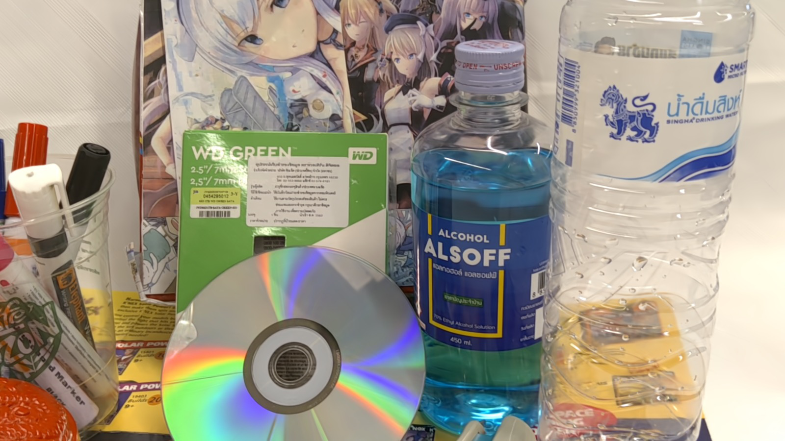

- **Problem.** Low-order SH cannot capture **specular and anisotropic** high-frequency
  view-dependent appearance; 3DGS "fakes" highlights by spawning extra floater Gaussians,
  hurting both quality and geometry.
- **Key idea.** Replace SH with an **Anisotropic Spherical Gaussian (ASG) appearance field**
  + a **feature-decoupling MLP** per Gaussian → models specular/anisotropic radiance
  **without** adding Gaussians; plus a **coarse-to-fine training** scheme to kill floaters,
  and **anchor-based Gaussians** (Scaffold-GS style) to cut storage/runtime.
- **Method (how).**
  - Each Gaussian carries a learnable **ASG latent** (the `_features_asg` in your code). An
    **ASGRender MLP** takes (position, view dir, ASG features, normal) → a **specular color
    residual** that is **added to the SH/base color** — *this is the `SpecularNetwork`
    interface your thesis builds on*.
  - **ASG** (Xu et al. 2013) = a spherical lobe with **separate tangent/bi-tangent
    bandwidths** → represents *elliptical/anisotropic* highlights that isotropic SH/SG
    cannot.
  - **Coarse-to-fine**: optimize low-res renders first → regularizes geometry, prevents
    over-densification and floaters (mirrors your phased specular activation after iter 3000
    and the SH-decay schedule).
  - Only Gaussians with opacity σ>0 are rendered through the differentiable rasterizer.
- **Results.** Large PSNR gains on specular/anisotropic scenes (e.g. 25.48→31.60 dB; 32.46→
  37.50 dB on examples) at real-time speed, plus SOTA on general benchmarks; ships an
  anisotropic dataset.
- **Relevance.** **The exact appearance model Spec-FastGS adopts.** Everything in your
  *Method* chapter — the 24-dim ASG latent, the `ASGRender` MLP, the additive specular
  residual on `sh_color`, the specular-after-3000 schedule, the sigmoid-vs-none output
  question (CLAUDE.md Option 1), the 12-dim vs 24-dim feature choice — traces to this paper.
  Cite as the direct parent and the quality baseline you must match/beat after fusing with
  FastGS speed.

---

## ★ Ref-NeRF: Structured View-Dependent Appearance — Verbin et al., CVPR 2022 (Oral) — `2112.03907`
**[METHOD — intellectual ancestor of specular reparameterization]**

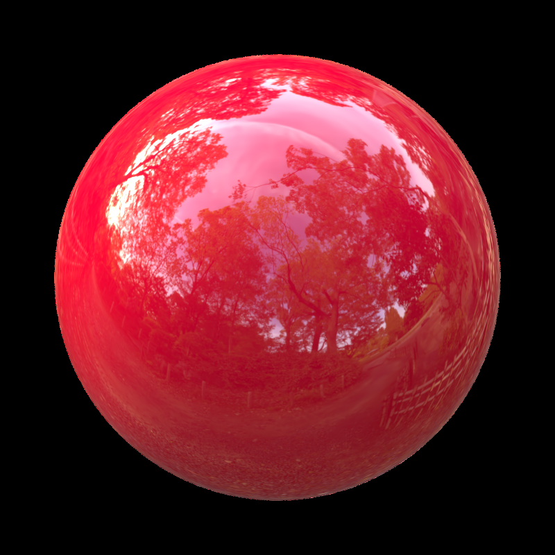

- **Problem.** NeRF parameterizes radiance by **view direction**, which varies too fast
  around highlights to interpolate → glossy artifacts that "fade in/out"; NeRF also fakes
  reflections with internal emitters → foggy geometry, bad normals.
- **Key idea.** Reparameterize outgoing radiance by the **reflection of the view vector about
  the normal** (`ωᵣ = 2(ω·n)n − ω`) → the reflected-radiance function is nearly *constant*
  across a surface and easy to interpolate; split color into **diffuse + specular**, add an
  **Integrated Directional Encoding (IDE)** modulated by **roughness**, and a **normal
  regularizer**.
- **Results.** Dramatically better specular realism and normals (e.g. 30.3→35.6 dB, normal
  MAE 59.5°→11.5°); interpretable diffuse/specular/roughness components for editing.
- **Relevance to Spec-FastGS.** The conceptual foundation for **every** specular method here,
  including ASG. Cite to explain *why* a structured specular term (reflection-direction
  +roughness) beats raw view-direction SH — the motivation for replacing SH with ASG. Its
  diffuse+specular split mirrors your `sh_color + specular residual`.

---

## ★ GaussianShader: 3DGS with Shading Functions for Reflective Surfaces — Jiang et al., CVPR 2024 — `2311.17977`
**[COMPARE — shading-function specular on 3DGS]**

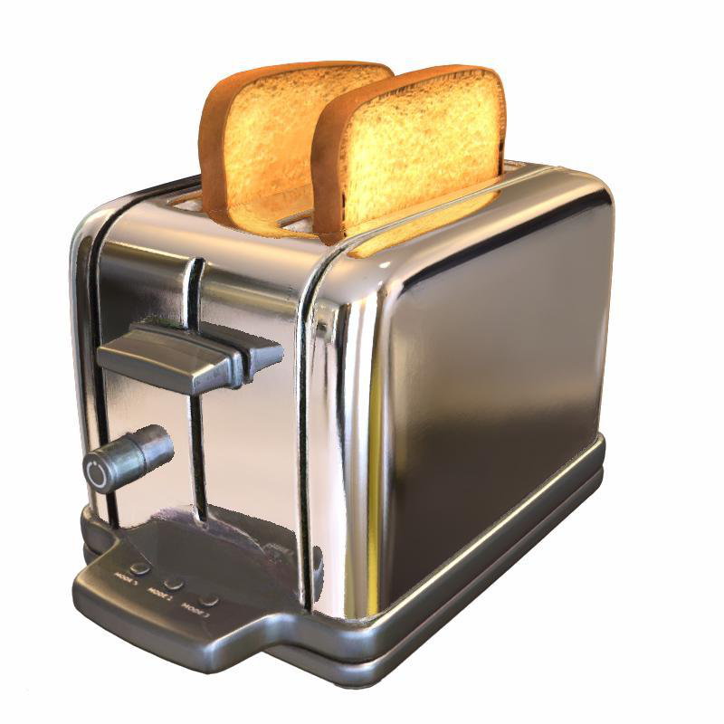

- **Problem.** 3DGS drops badly on reflective surfaces (no explicit appearance/shading
  model); Ref-NeRF/ENVIDR handle reflections but are 20–40× slower (hours).
- **Key idea.** Add a **simplified shading function** to each Gaussian: **diffuse + direct
  reflection (from a differentiable environment map) + a learned residual color** for complex
  reflections, all kept cheap to preserve real-time speed.
- **Method (how).** New shading attributes per Gaussian (normal, tint, diffuse, roughness,
  residual); a **normal from the shortest Gaussian axis + learned normal residual**, with a
  **normal–geometry consistency loss** (predicted normal vs. depth-derived normal).
- **Results.** +1.57 dB over 3DGS on specular datasets; 0.58 h vs Ref-NeRF's 23 h; real-time.
- **Relevance.** The closest *alternative* to Spec-Gaussian's residual design — both add a
  **learned residual color** to a base, but GaussianShader uses an explicit env-map shading
  model whereas Spec-Gaussian uses an ASG-MLP. The **shortest-axis normal + residual** is
  exactly the normal scheme your specular branch can reuse. Key comparison-table entry.

---

## ★ 3D Gaussian Splatting with Deferred Reflection — Ye, Hou, Zhou, SIGGRAPH 2024 — `2404.18454`
**[METHOD — deferred shading; directly informs your MLP-output design]**

- **Problem.** Per-Gaussian (forward) specular shading gives each Gaussian *independent*
  normal gradients that can't help each other; env-map reflection needs accurate normals but
  provides almost no gradient to refine them → unstable training.
- **Key idea.** **Deferred (two-pass) shading**: (1) splat per-Gaussian base color, normal,
  and a scalar **reflection strength** into screen-space G-buffers; (2) a **per-pixel** shader
  queries the environment map with the reflection direction and composites base + reflection.
- **Method (how).** The deferred pass creates a **gradient channel from pixel color → blended
  normal → each contributing Gaussian's normal**, so a Gaussian with a near-correct normal
  **propagates** it to overlapping neighbors → correct normals spread across the surface.
  Rough/anisotropic/GI effects are left to the base SH color (mirror reflection handled
  separately).
- **Results.** 26.91 dB at 80 FPS vs Ref-NeRF 25.03 dB at 0.02 FPS / GShader 24.97 dB —
  best quality *and* near-vanilla speed.
- **Relevance to Spec-FastGS.** **Cited in CLAUDE.md** for the MLP-output design. Two direct
  lessons: (1) **per-pixel/deferred** specular is more stable than per-Gaussian — relevant
  to how you apply the ASG residual; (2) **unbounded reflection output** (no sigmoid clamp) —
  supports your *Option 1 (remove sigmoid)* fix, since env-map reflection is HDR/unbounded.

---

## SpecNeRF: Gaussian Directional Encoding for Specular Reflections — Ma et al., CVPR 2024 — `2312.13102`
**[METHOD — Gaussian directional encoding; cited in CLAUDE.md]**

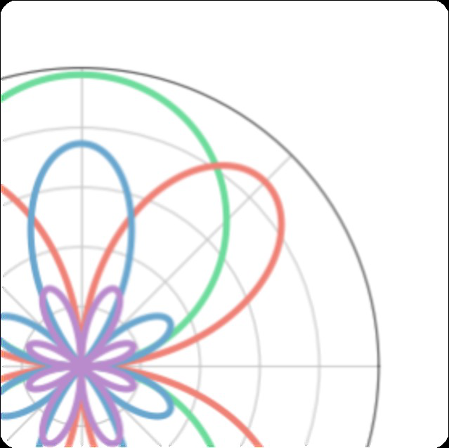

- **Problem.** Ref-NeRF's directional encoding is **spatially invariant** (assumes distant
  env-map lighting) → fails for **near-field** lighting where the effective env-map varies
  per location (indoor scenes).
- **Key idea.** A **learnable Gaussian directional encoding**: a set of 3D Gaussians encode
  the **5D ray space (origin + direction)**, emulating **prefiltered environment maps** whose
  preconvolved specular color can be evaluated at any 3D point with varying roughness (scale
  of the Gaussians ↔ roughness).
- **Method (how).** Reflection ray → Gaussian directional encoding → MLP → specular color;
  plus a **monocular-normal prior** to resolve shape-radiance ambiguity early in training.
- **Relevance.** **Cited in CLAUDE.md** as the encoding-design reference. The "Gaussian basis
  encodes view/reflection direction → decode specular" pattern is conceptually parallel to
  ASG (both are spherical-Gaussian appearance bases). Useful for justifying spatially-varying,
  roughness-aware specular encoding in your method discussion.

---

## NeRF-Casting: Improved View-Dependent Appearance with Consistent Reflections — Verbin et al., SIGGRAPH Asia 2024 — `2405.14871`
**[REF — ray-traced reflections; SOTA NeRF specular]**

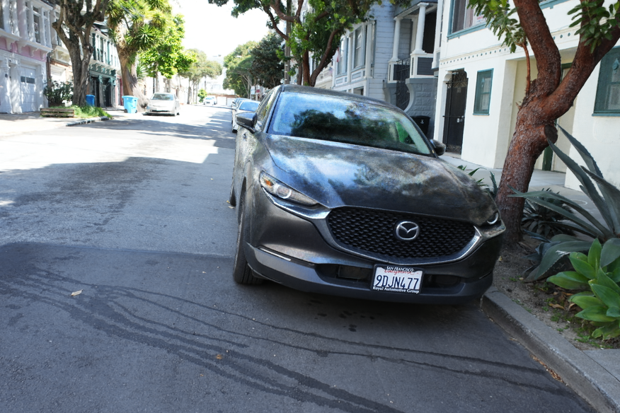

- **Problem.** Ref-NeRF-style methods only reflect **distant** env illumination and need a
  **huge MLP** to memorize outgoing radiance at every point — slow and inconsistent for
  **nearby** reflected content.
- **Key idea.** Bring **ray tracing into NeRF**: from points on the camera ray, **cast
  reflection rays through the recovered NeRF**, sample anti-aliased features of the reflected
  content, and decode them to color with a **small** MLP.
- **Results.** Consistent reflections of near + far content; SOTA on shiny real scenes at
  comparable optimization time.
- **Relevance.** Represents the "**reflect-and-trace**" school (vs. Spec-Gaussian's
  "encode-and-decode" appearance field). Cite to position ASG as the cheaper,
  rasterization-friendly alternative to ray tracing — your speed pillar forbids per-pixel ray
  tracing, motivating the ASG-MLP choice.

---

## GS-IR: 3D Gaussian Splatting for Inverse Rendering — Liang et al., CVPR 2024 — `2311.16473`
**[REF — inverse-rendering branch: normals + occlusion baking]**

- **Problem.** Bring **inverse rendering** (recover geometry + material/BRDF + illumination)
  to 3DGS; two obstacles — 3DGS has **no native normals**, and forward rasterization **can't
  trace occlusion** for indirect light.
- **Key idea.** **Depth-gradient-based normal regularization** + a **baking-based occlusion
  volume** (cache occlusion/indirect light, à la "indirect lighting cache").
- **Method (how).** Per-Gaussian material + a PBR rendering equation; normals from
  concentrated depth gradients; baked occlusion volumes give indirect illumination at
  interactive rates.
- **Relevance.** Cite as the **first 3DGS inverse-rendering** method and a source of the
  **depth-derivative normal** technique (an alternative to shortest-axis normals your
  specular branch could use). Background for "appearance vs. full decomposition" framing —
  your work does the former (cheaper).

---

## Relightable 3D Gaussians: BRDF Decomposition + Ray Tracing — Gao, Gu et al., ECCV 2024 — `2311.16043`
**[REF — per-Gaussian normal/BRDF/incident-light + BVH ray tracing]**

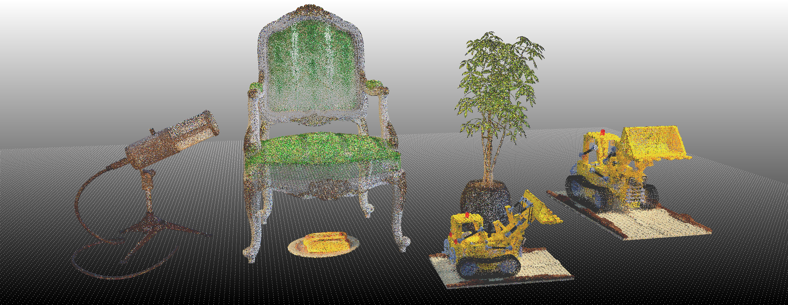

- **Problem.** Vanilla 3DGS cannot be **relit** (no material/lighting separation) and point
  reps lack ray tracing for shadows.
- **Key idea.** Augment each Gaussian with **normal + BRDF params + incident light**; render
  via **PBR per Gaussian** then α-composite; add **point-based ray tracing with a BVH** for
  efficient visibility/shadows.
- **Results.** Photorealistic relighting with realistic shadows; multi-object composition
  editing.
- **Relevance.** The relighting-capable cousin of GS-IR; cite in the inverse-rendering
  paragraph to contrast with your **appearance-only** (no full BRDF) specular residual —
  justify the simpler design by your real-time/speed constraint.

---

## IRGS: Inter-Reflective Gaussian Splatting with 2D Gaussian Ray Tracing — Gu et al., CVPR 2025 — `2412.15867`
**[REF — full rendering equation via differentiable 2D-Gaussian ray tracing]**

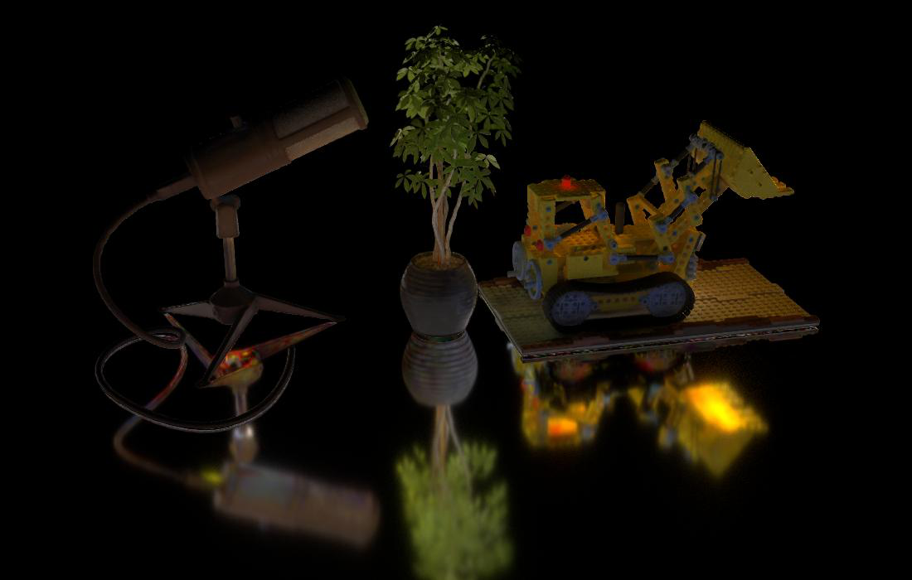

- **Problem.** Prior 3DGS inverse-rendering uses the **simplified (split-sum)** rendering
  equation or learnable params for indirect light → misses true **inter-reflection**.
- **Key idea.** Apply the **full rendering equation without simplification**, computing
  **visibility + indirect radiance on the fly** via a **differentiable 2D Gaussian ray
  tracing** (well-defined ray–splat intersections on a pretrained 2DGS).
- **Method (how).** Monte-Carlo sample the hemisphere at depth-map intersection points; trace
  secondary rays through the 2D Gaussians; an efficient scheme tames the MC cost; new
  indirect-radiance query for relighting.
- **Relevance.** State-of-the-art **inter-reflection** modeling — the high-accuracy / high-cost
  end of the spectrum. Cite as the upper bound your method deliberately does **not** chase
  (ray tracing breaks real-time), reinforcing the ASG/rasterization design trade-off. Builds
  on **2DGS** (cat 03).

---

## GS-ROR²: Bidirectional 3DGS + SDF for Reflective Object Relighting & Reconstruction — Zhu, Wang, Yang, TOG 2025 — `2406.18544`
**[REF — GS↔SDF mutual supervision for reflective geometry]**

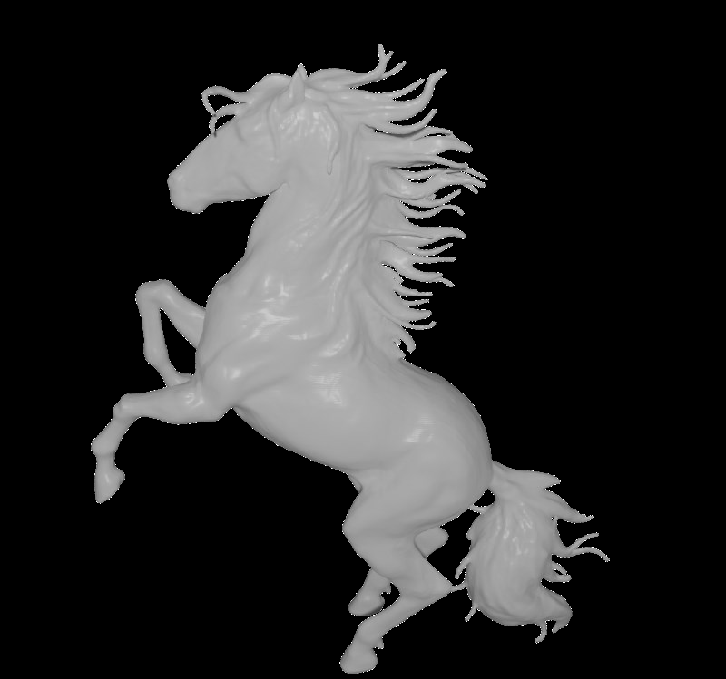

- **Problem.** 3DGS's discontinuous representation gives poor geometry/normals for reflective
  objects (highlights are hypersensitive to normal error); SDFs give robust geometry but slow
  ray marching.
- **Key idea.** **Bidirectional guidance**: an **SDF-aided Gaussian splatting** (mutual
  depth/normal supervision between blended Gaussians and a low-res SDF, avoiding SDF volume
  rendering) + **SDF-aware pruning** of floater Gaussians + a **GS-guided SDF refinement**
  (blended normals fine-tune the SDF).
- **Results.** Beats GS-based inverse rendering on relighting + mesh quality; 200+ FPS; ≤25–33%
  of NeRF-based training time.
- **Relevance.** Shows **deferred-shading + normal regularization + floater pruning** for
  reflective objects — its **SDF-aware pruning of distant-from-surface Gaussians** rhymes with
  your floater/over-reconstruction concerns. Object-level scope; cite as advanced
  reflective-geometry context.

---

## Reflective Gaussian Splatting (Ref-Gaussian) — Yao et al., ICLR 2025 — `2412.19282`
**[COMPARE — SOTA reflective GS with physically-based deferred rendering + inter-reflection]**

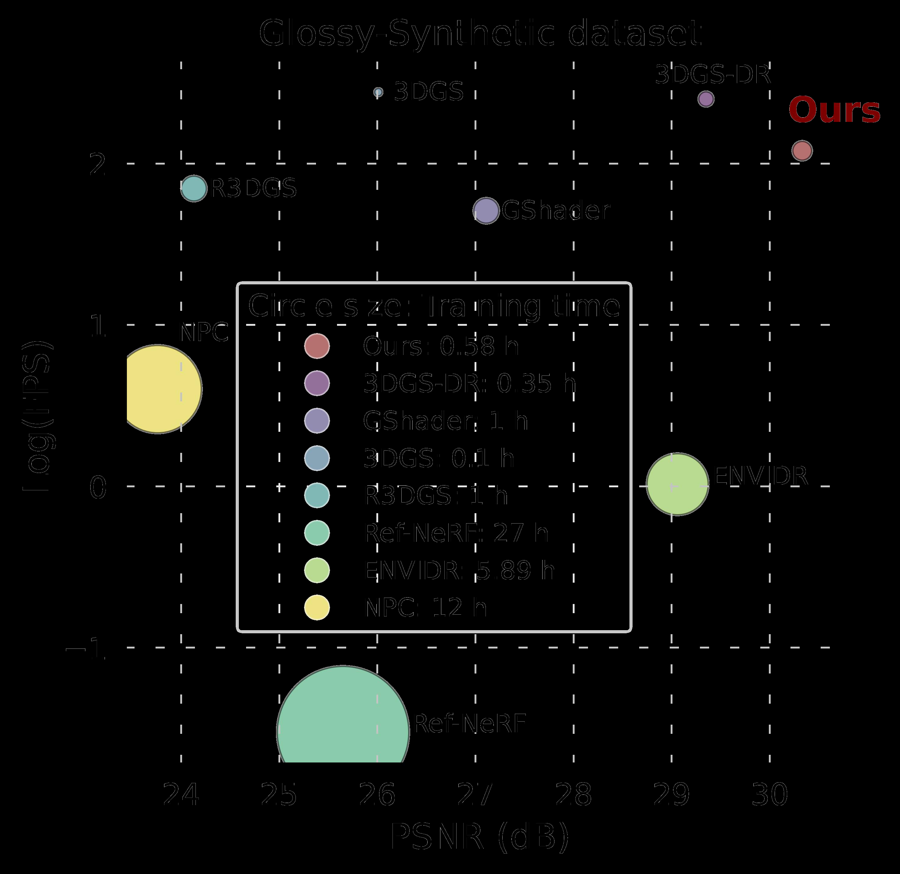

- **Problem.** Real-time, high-quality rendering of **reflective objects including
  inter-reflection** within a Gaussian framework.
- **Key idea.** **Physically-based deferred rendering** with per-pixel material (BRDF) via the
  **split-sum approximation** + **Gaussian-grounded inter-reflection** (realizing
  inter-reflection with Gaussian splatting "for the first time"), on a **2DGS** geometry
  backbone with a material-aware normal-propagation warm-up.
- **Results.** SOTA reflective rendering + competitive geometry, real-time.
- **Relevance.** The current **best-in-class reflective GS** — your strongest related-work
  comparison for the *reflection* sub-problem. Contrast: Ref-Gaussian pursues PBR + 
  inter-reflection (heavier); Spec-FastGS keeps a lightweight ASG residual for speed. Cite to
  delineate scope (NVS appearance vs. full PBR reflection).

---

## VoD-3DGS: View-opacity-Dependent 3D Gaussian Splatting — Nowak et al., 2025 — `2501.17978`
**[METHOD — view-dependent opacity for specular; closest to your view-gating]**

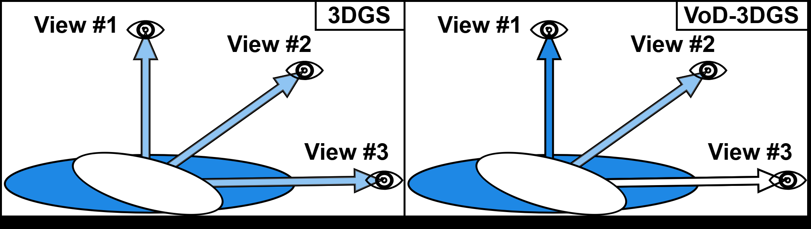

- **Problem.** 3DGS opacity is **view-independent**, so it cannot represent the way specular
  surfaces change apparent coverage/intensity with viewing angle.
- **Key idea.** Make **opacity depend on the viewing direction** (view-opacity-dependent
  Gaussians) so highlights can appear/disappear correctly across views, improving specular
  reconstruction without a full shading model.
- **Relevance to Spec-FastGS.** **Conceptually the nearest to your visibility-gated /
  view-conditioned specular** — both modulate a per-Gaussian quantity by view. Cite when
  motivating view-dependence of the specular term, and as evidence that lightweight
  view-conditioning (vs. full PBR) is a valid, efficient route — aligned with your speed
  goals.

---

## RTR-GS: 3DGS for Inverse Rendering with Radiance Transfer and Reflection — Cao et al., ACM MM 2025 — `2507.07733`
**[REF — hybrid radiance + PBR for arbitrary reflectance]**

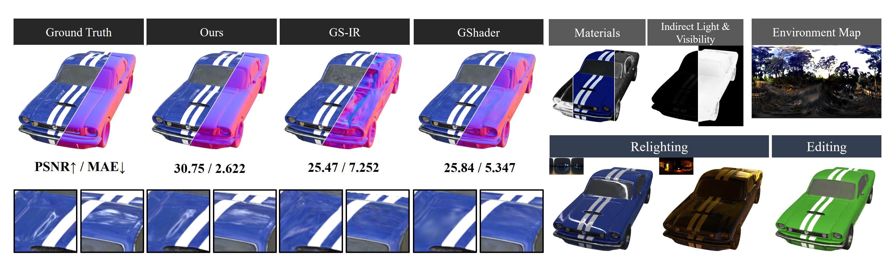

- **Problem.** Pure PBR inverse-rendering struggles with arbitrary/complex reflectance; pure
  radiance models can't relight.
- **Key idea.** A **hybrid** framework combining **learned radiance transfer** with
  **physically-based reflection**, decomposing BRDF + lighting while robustly rendering
  objects of arbitrary reflectance, yielding credible relighting.
- **Relevance.** The recent (2025) end of the inverse-rendering spectrum; cite for
  completeness in the reflective/relighting related-work and to show the field's trajectory
  toward hybrid appearance+PBR models — context that frames your appearance-only ASG choice
  as a deliberate efficiency trade-off rather than a limitation.

---

### How to frame this chapter against Spec-FastGS
1. **Establish the gap** with 3DGS + Ref-NeRF: SH can't do specular; reflection-direction
   reparameterization fixes it.
2. **Pick the appearance-field route** (Spec-Gaussian ASG ★) over inverse rendering
   (GS-IR/IRGS/GS-ROR/RTR-GS) and ray tracing (NeRF-Casting) — justified by your **real-time
   + fast-training** constraint (FastGS pillar).
3. **Position against the closest GS appearance methods**: GaussianShader (env-map residual),
   Deferred Reflection (deferred per-pixel + unbounded output → your sigmoid fix),
   VoD-3DGS (view-dependent opacity → your view-gating), Ref-Gaussian (PBR upper bound).
4. **State the novelty**: ASG specular *fused with* FastGS multi-view-consistency
   densification + your efficiency fixes (visibility-gated MLP, Laplacian loss, soft SH
   decay) — a combination none of the above attempt.
