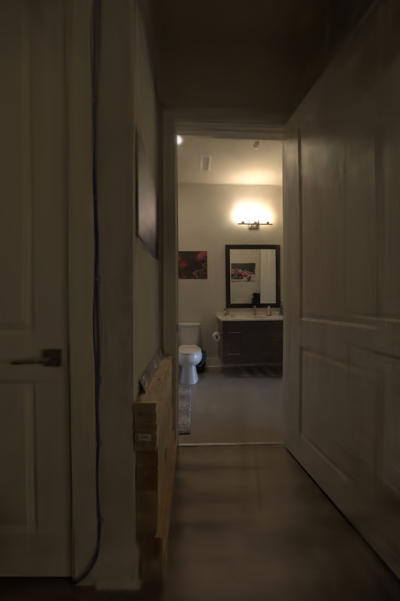
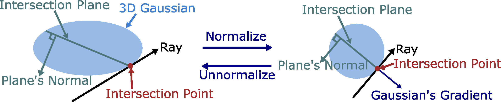

# 03 — Quality, Structure & Anti-Aliasing

These papers improve 3DGS along axes orthogonal to raw speed: **anti-aliasing**, **surface
geometry**, and **structured/anchored Gaussians**. They matter to the thesis because (a)
your quality regression (SSIM/LPIPS) lives here, (b) Scaffold-GS underpins the hash-grid
appearance-field contribution, and (c) several reflective-GS methods (cat 02) build on 2DGS.

---

## ★ Scaffold-GS: Structured 3D Gaussians for View-Adaptive Rendering — Lu et al., CVPR 2024 — `2312.00109`
**[METHOD — basis for the hash-grid / anchored appearance field, Sol-7]**

- **Problem.** Vanilla 3DGS over-expands Gaussians in texture-less/large regions and stores
  redundant per-Gaussian attributes; appearance is not spatially shared.
- **Key idea.** Anchor Gaussians to a **sparse voxel/anchor grid**; each anchor holds a
  feature + a few learnable offsets, and **small MLPs predict the attributes (opacity,
  color, scale, rotation) of its child Gaussians on the fly**, conditioned on viewing
  direction & distance.
- **Method (how).** Anchors are grown/pruned by accumulated gradient; per-view the MLP
  decodes only the anchors in the frustum → fewer Gaussians, view-adaptive appearance,
  better generalization to novel views.
- **Results.** Matches/beats 3DGS quality with **far fewer Gaussians** and lower storage.
- **Relevance to Spec-FastGS.** The direct precedent for **Sol-7 (hash-grid appearance
  field)**: replace per-Gaussian SH/ASG with **anchor-/grid-decoded appearance**. Also a
  conceptual sibling of your *visibility-gated MLP* (decode appearance only for in-frustum
  primitives). Cite as the strongest "appearance is a function of a shared spatial field"
  reference alongside Instant-NGP.

---

## ★ Mip-Splatting: Alias-free 3D Gaussian Splatting — Yu et al., CVPR 2024 (Best Student Paper) — `2311.16493`
**[METHOD — quality-regularization reference]**

- **Problem.** 3DGS **aliases** under zoom/resolution changes: Gaussians shrink below the
  pixel footprint (high-frequency artifacts) or the fixed 2D dilation causes erosion/
  "donut" artifacts when zooming out.
- **Key idea.** Two filters — a **3D smoothing filter** that band-limits each Gaussian to
  the maximal sampling rate observed across training views, and a **2D Mip filter** (a 2D
  Gaussian approximating the box-shaped pixel footprint) replacing the dilation.
- **Method (how).** The 3D filter caps each Gaussian's frequency by its scene-scale Nyquist
  limit; the 2D Mip filter integrates over the pixel area → alias-free at arbitrary
  resolutions/zoom, with no extra training cost.
- **Results.** Large gains in out-of-distribution (zoom/resolution) testing; minor in-distribution gains.
- **Relevance to Spec-FastGS.** Cite in the *quality* discussion: aliasing is a competing
  source of SSIM/LPIPS error distinct from your specular-energy deficit. The 3D-smoothing
  idea (band-limit by sampling rate) is a clean regularizer you can mention as complementary
  to your Laplacian-pyramid loss. Its improved densification metric was later folded into GOF.

---

## ★ 2D Gaussian Splatting for Geometrically Accurate Radiance Fields — Huang et al., SIGGRAPH 2024 — `2403.17888`
**[REF — surfel representation used by many reflective-GS methods]**

- **Problem.** 3D Gaussians are volumetric blobs with **no well-defined surface/normal** →
  inconsistent geometry and noisy depth/normals across views.
- **Key idea.** Collapse the 3rd axis: represent the scene with **2D oriented Gaussian
  disks (surfels)** that lie *on* the surface, giving an unambiguous normal per primitive.
- **Method (how).** A **perspective-correct, ray–splat intersection** rasterizer plus
  **depth-distortion and normal-consistency regularizers** yield accurate surfaces while
  staying real-time.
- **Results.** SOTA surface reconstruction quality among splatting methods at 3DGS-like speed.
- **Relevance to Spec-FastGS.** **Normals are prerequisite for specular shading.** Your
  specular branch uses per-Gaussian normals; 2DGS is the canonical "give Gaussians real
  normals" citation, and it is the geometric substrate of IRGS / RTR-GS / Ref-Gaussian in
  cat 02. Cite when justifying normal estimation for the ASG/specular term.

---

## Gaussian Opacity Fields (GOF) — Yu et al., SIGGRAPH Asia 2024 — `2404.10772`
**[REF — surface extraction + improved densification metric]**

- **Problem.** Extracting watertight surfaces from 3D Gaussians usually needs Poisson/TSDF
  post-processing; densification metrics under-split in detailed regions.
- **Key idea.** Define an **opacity field directly from the Gaussians** (ray-Gaussian
  intersection opacity) enabling **training-free surface extraction via level sets**, plus
  an **improved gradient-based densification** criterion.
- **Method (how).** Per-ray opacity from explicit Gaussian intersections; tetrahedra-based
  meshing of the level set; the densification metric (later adopted by Mip-Splatting)
  better identifies under-reconstructed regions.
- **Relevance to Spec-FastGS.** Its **densification metric** is part of the lineage your
  fast-densification chapter surveys (it appears in "Revising Densification", cat 01).
  Secondary cite for unbounded-scene surface quality.

---

## SA-GS: Scale-Adaptive Gaussian Splatting for Training-Free Anti-Aliasing — Song et al., 2024 — `2403.19615`
**[REF — test-time anti-aliasing alternative to Mip-Splatting]**

- **Problem.** Mip-Splatting removes aliasing but **requires modifying training**; can we
  fix aliasing on an already-trained 3DGS model?
- **Key idea.** A **training-free, test-time 2D scale-adaptive filter** applied at render
  time that adjusts each Gaussian's screen-space footprint to the current sampling rate.
- **Method (how).** At inference, expand/clamp the projected 2D Gaussian by a scale factor
  derived from the rendering resolution; optionally combine with integration for stronger
  anti-aliasing — no retraining of the model parameters.
- **Results.** Matches much of Mip-Splatting's anti-aliasing benefit with zero training cost.
- **Relevance to Spec-FastGS.** Useful contrast in the quality discussion: shows
  anti-aliasing can be decoupled from training, reinforcing that your **training-time**
  changes (Laplacian loss, SH decay) target a *different* error source (specular structure),
  not aliasing. Minor/optional citation.
