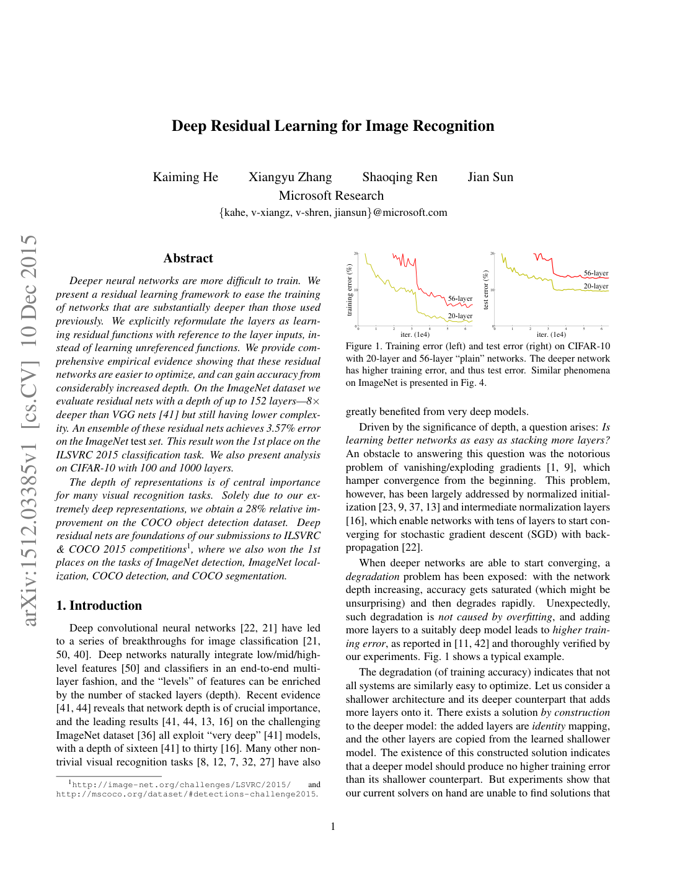
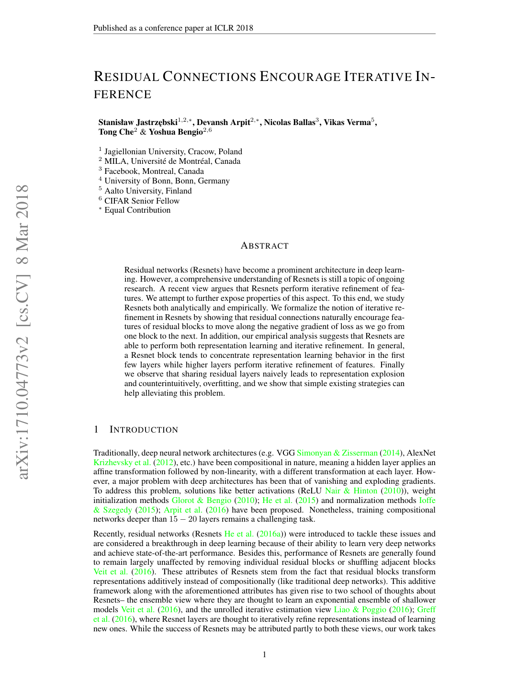
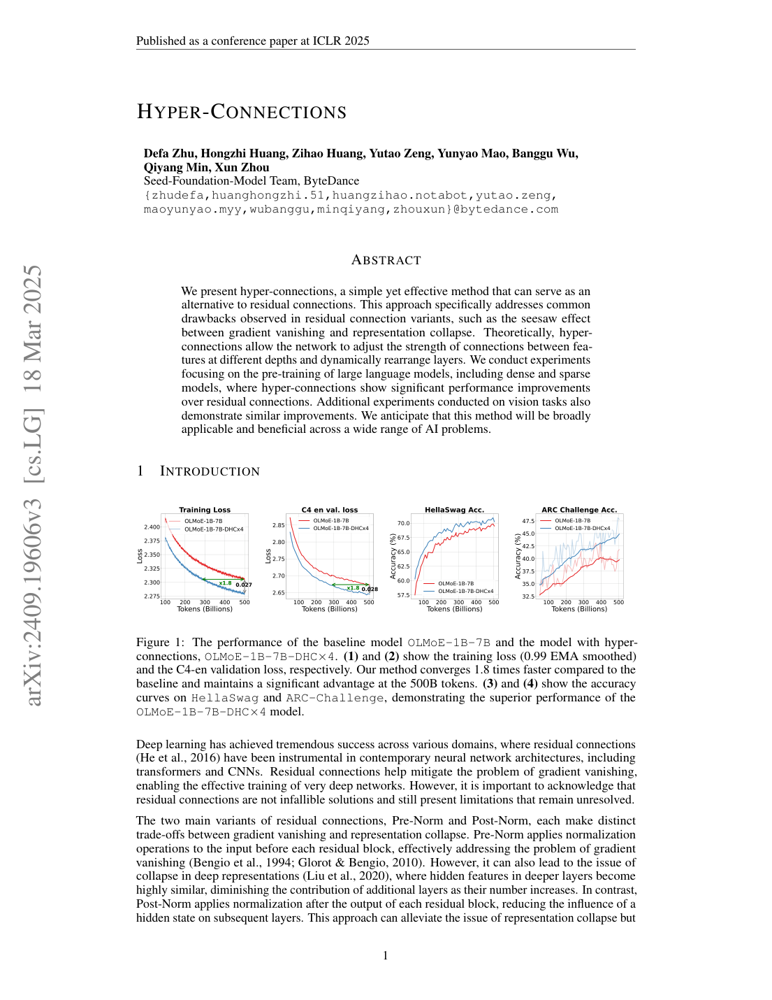
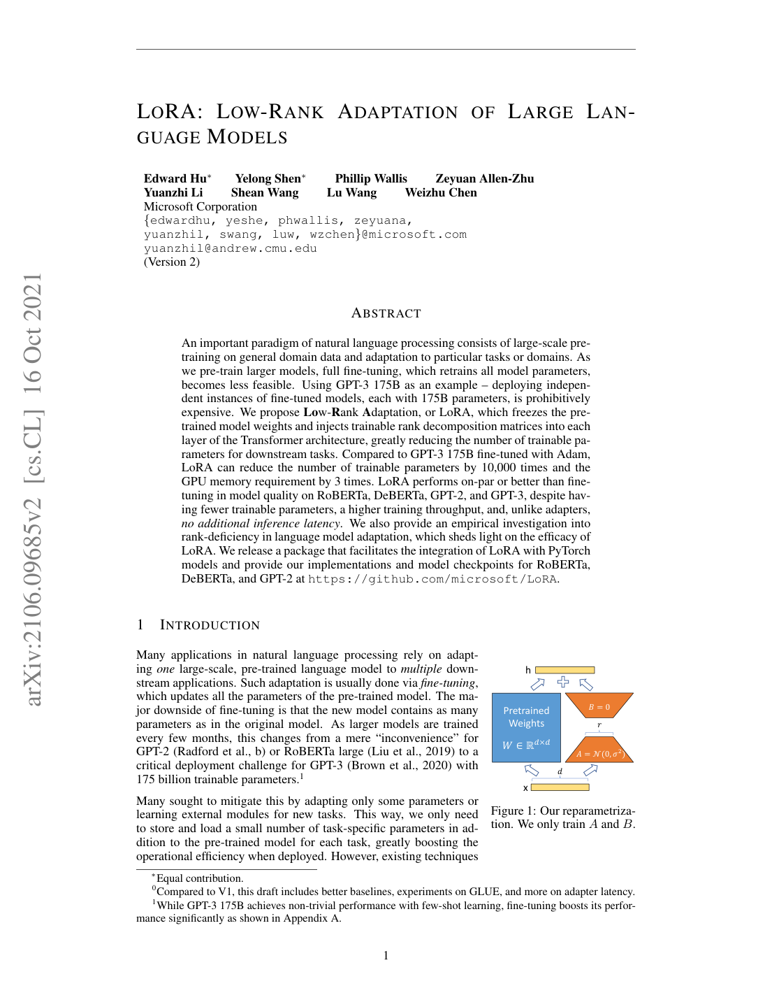

# 04 — Method Building Blocks (MLP / Optimization Techniques)

These are **not** 3DGS papers — they are the architectural and optimization primitives that
justify your *specular-MLP design space* and the two pending contributions. In the thesis
they belong in the *Method* chapter, where you motivate each `ASGRender` variant
(Options 1–5 in `CLAUDE.md`) and the LoRA-ASG / hash-grid ideas.

---

## ★ SIREN: Implicit Neural Representations with Periodic Activation Functions — Sitzmann et al., NeurIPS 2020 — `2006.09661`
**[METHOD — specular-MLP swap Option 3]**

- **Problem.** ReLU MLPs are **biased toward low frequencies** ("spectral bias") and their
  derivatives are trivial, so they fit smooth signals but blur fine, high-frequency detail
  and cannot represent signals' derivatives well.
- **Key idea.** Use **sine activations** `φ(x) = sin(ω₀ · Wx + b)`; the resulting network
  (and all its derivatives) is itself a composition of sinusoids → can represent
  high-frequency content and obey differential constraints.
- **Method (how).** A **principled initialization** keeps activation distributions stable
  across depth (weights ~ U(−√(6/n), √(6/n)), first layer scaled by ω₀≈30). Fits images,
  audio, SDFs, and PDE solutions with far sharper detail than ReLU+positional-encoding.
- **Relevance to Spec-FastGS.** Specular highlights are **high-frequency, view-dependent**
  signals — exactly SIREN's strength. This is the paper behind **specular-MLP Option 3**
  (replace ReLU in `ASGRender` with SineLayers + SIREN init). Caveat to state in the
  thesis: SIREN needs fresh weight initialization, so it is a *re-train* swap, not a drop-in
  fine-tune.

---

## ★ Deep Residual Learning for Image Recognition (ResNet) — He et al., CVPR 2016 — `1512.03385`
**[METHOD — residual skip, Options 2 & 5]**

- **Problem.** Deeper plain networks **degrade** (higher training error) — vanishing
  gradients and optimization difficulty, not overfitting.
- **Key idea.** Learn a **residual** `H(x) = F(x) + x` via identity **skip connections**;
  it is easier to push F→0 than to fit an identity with stacked nonlinear layers.
- **Method (how).** Residual blocks (`y = F(x, {Wᵢ}) + x`) let gradients flow through the
  identity path, enabling 50–152-layer networks to train stably.
- **Relevance to Spec-FastGS.** The foundation for **specular-MLP Option 2** (add a skip
  `h2 = ReLU(fc2(h1)) + h1` inside `ASGRender`) and **Option 5** (deeper/wider MLP with
  residual connections). Cite to justify that adding depth/capacity to the specular MLP is
  safe only *with* residual connections.

---

## Residual Connections Encourage Iterative Inference — Jastrzębski et al., ICLR 2018 — `1710.04773`
**[METHOD — theoretical backing for the residual skip]**

- **Problem.** *Why* do residual connections help, beyond gradient flow?
- **Key idea.** Residual blocks perform **iterative inference**: successive blocks refine
  the same representation toward lower loss (an unrolled estimation), first reducing
  representation error then moving along the loss surface.
- **Method (how).** Analyses (Taylor expansion of the loss w.r.t. block output, empirical
  refinement curves) showing each block nudges features in the loss-decreasing direction;
  also flags/repairs a representation-"explosion" failure mode.
- **Relevance to Spec-FastGS.** The deeper theoretical citation for adding a residual skip
  to `ASGRender` (Option 2): frames the specular MLP as **iteratively refining the base SH
  color toward the correct specular appearance**, which matches the "residual added to
  `sh_color`" design.

---

## ★ Hyper-Connections — Zhu et al. (ByteDance), ICLR 2025 — `2409.19606`
**[METHOD — specular-MLP swap Option 4]**

- **Problem.** Residual connections force a trade-off (a "seesaw") between **gradient
  vanishing** and **representation collapse** — fixed-weight skip vs. fixed-weight residual
  each fail at one end.
- **Key idea.** Generalize residuals to **hyper-connections**: maintain **n copies
  (expansion rate n) of the hidden state** and learn how to mix them with **depth-connection
  weights (A_r, A_m)** and **width-connection weights (B)** — networks can even learn the
  *layout* (sequential vs parallel) of layers.
- **Method (how).** **Static (SHC)** = learnable but input-independent A/B matrices;
  **Dynamic (DHC)** = predicted per-token. Drop-in around any block; gains in LLM/vision
  pre-training at negligible cost.
- **Relevance to Spec-FastGS.** **Specular-MLP Option 4.** `CLAUDE.md` correctly specifies
  **n = 2, static (SHC)** for the 3-layer specular MLP — the strongest *theoretical* upgrade
  to `ASGRender`. Cite as the most novel architecture choice if you adopt it.

---

## LoRA: Low-Rank Adaptation of Large Language Models — Hu et al., ICLR 2022 — `2106.09685`
**[METHOD — basis for low-rank ASG factorization, Sol-6 contribution]**

- **Problem.** Full fine-tuning of large models updates *all* parameters — expensive in
  compute and storage.
- **Key idea.** Freeze the weight `W₀` and learn a **low-rank update** `ΔW = B A` with
  rank `r ≪ d`; only `A, B` are trained (`h = W₀x + BAx`).
- **Method (how).** The rank-r bottleneck captures the "intrinsic dimensionality" of the
  adaptation; adds no inference latency (BA can be merged into W₀), cuts trainable params
  by orders of magnitude.
- **Relevance to Spec-FastGS.** The template for your **low-rank ASG factorization
  (Sol-6)**: instead of a dense **24-dim per-Gaussian ASG latent**, store a **shared basis
  B + small per-Gaussian coefficients** (rank-r), cutting per-Gaussian storage while
  keeping expressivity — a candidate thesis contribution. Pair the citation with TensoRF
  (cat 00) as the radiance-field instantiation of the same low-rank principle.
