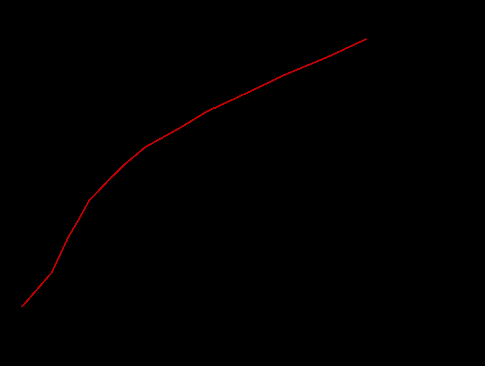
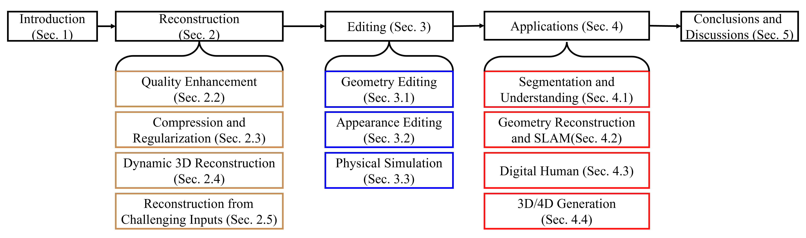

# 05 — Surveys

Use these to (a) populate the *Related Work* taxonomy and (b) borrow a defensible
categorization of the 3DGS literature so your contribution is positioned, not floating.

---

## A Survey on 3D Gaussian Splatting — Chen & Wang, IEEE TPAMI 2025 — `2401.03890`
**[REF — primary survey for the related-work taxonomy]**

- **Scope.** The first comprehensive survey of 3D Gaussian Splatting. Frames 3DGS as an
  **explicit, unstructured, real-time radiance-field** paradigm and organizes the field
  along optimization (densification, regularization), efficiency/compression, and
  applications (SLAM, dynamic scenes, generation, autonomous driving, avatars).
- **Useful structure to borrow.** A clean split between **(i) improving quality**
  (anti-aliasing, surfaces, materials/appearance) and **(ii) improving efficiency**
  (training speed, compression, memory). Your thesis sits at the intersection — *appearance
  quality (Spec-Gaussian)* × *training efficiency (FastGS)*.
- **Relevance.** The anchor citation for the opening of your Related Work chapter; lets you
  say "within the taxonomy of [survey], Spec-FastGS contributes to both the appearance and
  efficiency branches simultaneously."

---

## 3D Gaussian Splatting: Survey, Technologies, Challenges, and Opportunities — Fei et al., 2024 — `2403.11134`
**[REF — complementary survey, technology-axis taxonomy]**

- **Scope.** A second large survey, organized by **technology axes** — initialization,
  attribute representation, splatting/rasterization, densification & pruning strategies,
  regularization, and downstream tasks — with an explicit catalogue of open challenges
  (memory, anti-aliasing, view-dependent effects, geometry accuracy).
- **Useful structure to borrow.** Its **densification-and-pruning** sub-taxonomy (gradient
  criteria, budget/score methods, multi-view cues) is the exact slot where FastGS,
  AbsGS, Pixel-GS, Taming-3DGS, Mini-Splatting, etc. (cat 01) are compared — gives you a
  ready-made axis for your *fast-training* related-work table.
- **Relevance.** Complements the TPAMI survey; cite together so the related-work coverage
  looks complete, and lift its "view-dependent appearance is an open challenge" framing to
  motivate the specular pillar.

---

### How to cite the surveys in the thesis
Open Related Work with the two surveys to establish the 3DGS landscape and its two
recognized frontiers (quality vs. efficiency). Then cite the per-topic papers in
`01_*`–`04_*` as the concrete instances, and end the section by stating that **no prior
work jointly optimizes multi-view-consistency fast densification (FastGS) with an
anisotropic specular appearance field (Spec-Gaussian)** — your gap statement.
