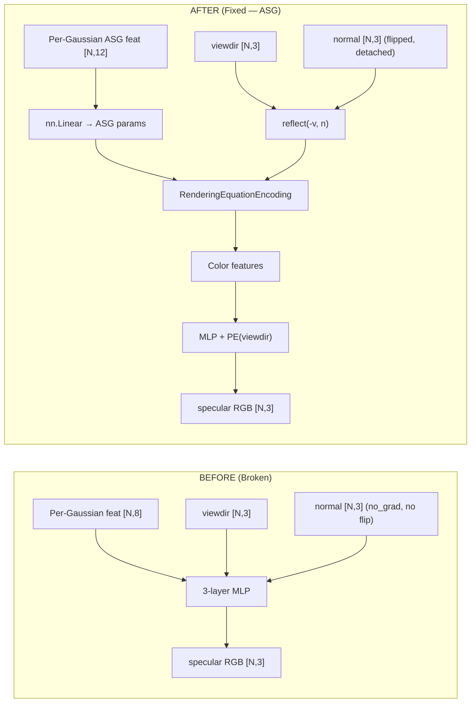

# Walkthrough: Spec-FastGS Specular Integration Fix

## Summary

Fixed 6 root causes that made the spec-fastgs specular modeling ineffective. The core problem was that the specular model was a **naive 3-layer MLP** instead of the baseline's **ASG (Anisotropic Spherical Gaussian)** physics-informed architecture.

## Architecture: Before vs After

## Files Changed

### New Files
| File | Purpose |
|------|---------|
| [quaternion_utils.py](file:///d:/Thesis/All/spec-fastgs/specular/quaternion_utils.py) | Ported from baseline — provides `init_predefined_omega()` for ASG encoding |

### Modified Files

| File | What Changed |
|------|-------------|
| [specular_model.py](file:///d:/Thesis/All/spec-fastgs/specular/specular_model.py) | **Complete rewrite**: Naive MLP → ASG-based wrapper with `train_setting()`, LR scheduler, `save/load_weights()` |
| [__init__.py](file:///d:/Thesis/All/spec-fastgs/specular/__init__.py) | Updated export |
| [normal_utils.py](file:///d:/Thesis/All/spec-fastgs/specular/normal_utils.py) | **Rewritten**: Added `flip_align_view()`, removed `@torch.no_grad()`, uses baseline's `get_minimum_axis()` |
| [gaussian_model.py](file:///d:/Thesis/All/spec-fastgs/scene/gaussian_model.py) | Added `asg_degree` param; `specular_feat_dim` now derives from `asg_degree` (12 for real, 24 for synthetic) |
| [__init__.py](file:///d:/Thesis/All/spec-fastgs/gaussian_renderer/__init__.py) | Specular block: viewdir passed for normal flip, normals detached, calls `.step()` instead of `.__call__()` |
| [train.py](file:///d:/Thesis/All/spec-fastgs/train.py) | Uses `SpecularModel(is_real, is_indoor)` with `train_setting()`, auto LR decay, `save_weights()`. Removed L2 reg and manual optimizer |
| [render.py](file:///d:/Thesis/All/spec-fastgs/render.py) | Loads correct `SpecularModel(is_real, is_indoor)` with `.load_weights()` |
| [general_utils.py](file:///d:/Thesis/All/spec-fastgs/utils/general_utils.py) | Added `get_linear_noise_func()` for specular LR scheduling |
| [arguments/__init__.py](file:///d:/Thesis/All/spec-fastgs/arguments/__init__.py) | `asg_degree` default 12 (real); removed unused `specular_lr`, `specular_reg_weight` |
| [run_spec-fastgs.sh](file:///d:/Thesis/All/spec-fastgs/run_spec-fastgs.sh) | Added `--is_real` to all scenes, `--is_indoor` to room/counter/kitchen/bonsai |

### Archived Files
| File | Reason |
|------|--------|
| [train_specular.py](file:///d:/Thesis/All/spec-fastgs/archive/train_specular.py) | Deprecated two-stage pipeline — joint training in `train.py` is now the standard |

## Key Design Decisions

1. **No specular L2 regularization**: The baseline doesn't use it. ASG's physics-informed structure naturally constrains the specular output — the rendering equation encoding acts as an implicit regularizer.

2. **Specular LR = `feature_lr / 10` with linear decay**: Matching baseline exactly. The specular MLP starts at a low LR and decays linearly, preventing overfitting while allowing the specular component to converge smoothly.

3. **Normal detachment**: Normals are detached before passing to the specular MLP (matching baseline). This prevents the specular loss from distorting Gaussian geometry — the geometry should be driven by reconstruction loss, not specular fitting.

4. **`asg_degree=12` default**: Since the user is benchmarking on real scenes (mip-NeRF 360), the default is set to 12 (SpecularNetworkReal). For synthetic scenes, pass `--asg_degree 24`.

## Next Steps

1. **Train on counter scene**: Run the active line in `run_spec-fastgs.sh`
2. **Compare results**: Check PSNR/SSIM/LPIPS vs your previous runs and vs baseline
3. **Expand to all scenes**: Uncomment other scenes in the run script
